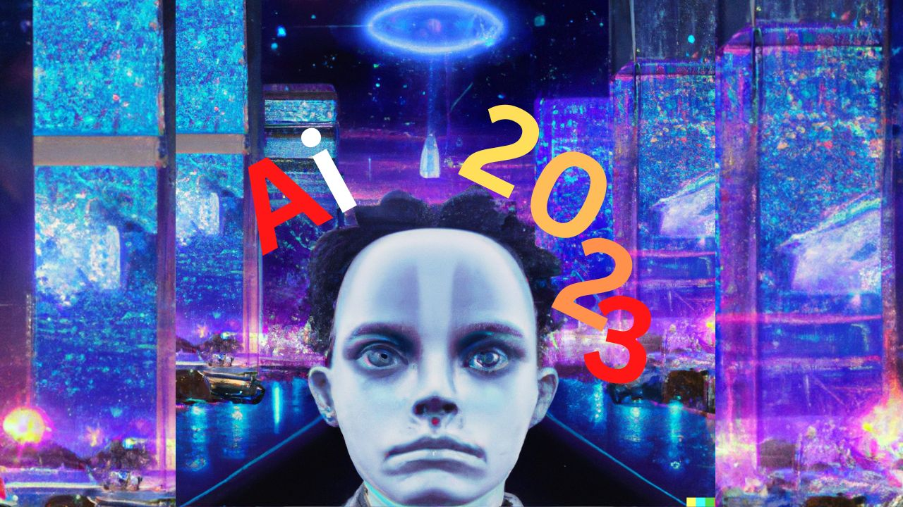

<!-- ensures every link below opens in a new tab similar to HTML target="_blank" -->
<base target="_blank">

## ✨ INTRO

In this article, I will be going through the Powerful Ai Innovations That Will Change The World In 2023 and Beyond categorized into 7 (seven)  ❤.

## ⏪️ VIDEO

If you prefer to watch the video, then below is the full video.

If not, continue to read the text format.

## 📚 (7) Stable Diffusion AI Image Generator

This Ai generates stable diffusion images that are gorgeous and pro with just basic instructions. making it useable by non-artist.

- [Starryai Stable Diffusion](https://starryai.com/stable-diffusion?ref=AiHiPUniversity.com "Starryai Stable Diffusion Website")

## 🚀 (6) NFT Art Generator AI

These are Ai that generates NFT Arts.

- [Starryai Art Ai](https://starryai.com/create-nft-art-with-artificial-intelligence?ref=AiHiPUniversity.com "Starryai Art Ai Website")

## 📚 (5) Avatar Generator AI

These are Ai that can help you to generate Avatars for your social media and profile picture.

- [Starryai Avatar Ai](https://www.starryai.com/starrytars?ref=AiHiPUniversity.com "Starryai Art Ai Website")

## 🚀 (4) Coding AI

These are Ai that enhances programmers in their coding. While some generate complete codes and logic, others serve as Ai pair programmer.

- [OpenAi Codex Ai](https://openai.com/blog/openai-codex?ref=AiHiPUniversity.com "OpenAi Codex Ai Website")
- [Github Copilot Ai](https://github.com/features/copilot?ref=AiHiPUniversity.com "Github Copilot Ai Website")

## 📚 (3) Text To Speech/Speach to Text and Translation AI

This Ai can transcribe audio to text and even translate to/from multiple languages.

- [OpenAi Whisper Ai](https://github.com/openai/whisper?ref=AiHiPUniversity.com "OpenAi Whisper Ai Website")

## 🚀 (2) Image Generator AI

These are Ai that can generate realistic images just by following human plain text descriptions of how the image should look like.

For example, I used one of the Images generating AI called DALL-E to generate the image used for this post above by simply describing it in text.

- [OpenAi DALL-E Ai](https://labs.openai.com/e?ref=AiHiPUniversity.com "OpenAi DALL-E Ai Website")
- [Midjourney Ai](https://midjourney.com?ref=AiHiPUniversity.com "Midjourney Ai Website")

## 👍 (1) Text To Speech/Speach to Text and Translation AI

These are Ai that can mimic human-like conversation during chat.

- [OpenAi ChatGPT Ai](https://chat.openai.com/chat?ref=AiHiPUniversity.com "OpenAi ChatGPT Ai Website")

