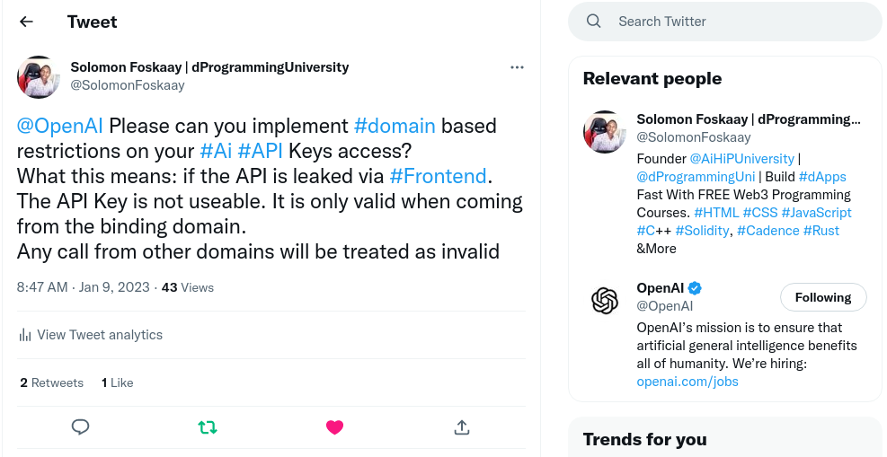

<!-- ensures every link below opens in a new tab similar to HTML target="_blank" -->
<base target="_blank">

## ✨ INTRODUCTION

In this course, I will be guiding you step by step through how to build and deploy an AI-powered chatbot like ChatGPT using Svelte, Sveltkit (for Frontend), ExpressJs (for Backend) and Openai API.

Then deploy the AI chatbot app to Vercel (Frontend hosting) and Render (Backend hosting)  ❤.

### 🧑‍💻 Meet Course Instructor

**i. FULL NAME**: Solomon Foskaay

**ii. BIO/EXPERIENCE**: 13Years+ in IT (as a Web designer (WordPress), Digital Marketing & SEO expert, Web3/Crypto Researcher and now AI/Game/Metaverse/Web2/Web3 Developer Instructor).

**iii. CONNECT ON SOCIAL MEDIA**:

- GitHub: [Solomon Foskaay](https://github.com/SolomonFoskaay?ref=AiHiPUniversity.com "Solomon Foskaay Github Profile")
- Twitter: [@SolomonFoskaay](https://twitter.com/SolomonFoskaay?ref=AiHiPUniversity.com "Solomon Foskaay Twitter Profile")
- LinkedIn: [Solomon Foskaay](https://Linkedin.com/in/Foskaay?ref=AiHiPUniversity.com "Solomon Foskaay LinkedIn Profile")

### 🛂 Course Prerequisites

Prerequisites for taking this course:

**(1)** [Nodejs](https://nodejs.org/en/download?ref=AiHiPUniversity.com "Nodejs Website")

Let us check if you have it already

Open your terminal and run this command `node -v` if it returns something like `v18.4.0` hurray you have `nodejs` installed and you can move to the next tool.

If it shows an error or nothing, then you need to install the latest LTS version)

**(2)** [PNPM](https://pnpm.io/installation?ref=AiHiPUniversity.com "PNPM Website") Node package manager preferable over NPM and YARN (Install if not having it yet)

#### 💫 (3) Required Basic knowledge

Essential Basic knowledge of:
  
**i.** Using CLI

**ii.** Git/Github

**iii.** IDE/Code Editor like Visual Studio Code (VSCode)

**iv.** Svelte/Sveltekit (frontend)

**v.** ExpressJs (backend)

**vi.** Web Hosting & Domain Hosting

#### 🔍️ (4) Optional Basic knowledge

Optional Basic knowledge of:

**i.** Openai large language AI models and their API

**ii.** Vercel (frontend hosting)

**iii.** Render (backend hosting)

### 🏷️ Recommended VSCode Extensions

Recommended VSCode Extensions For This Course

**i.** *GitLens VSCode Extention* - for tracking GitHub commit and other related things to Git

**ii.** *Grammarly  VSCode Extention* - spell checker

**iii.** *Prettier  VSCode Extention* - is a code formatter

**iv.** *Svelte for VS Code VSCode Extention* - get access to Svelte pre-made elements and auto-corrections when using Svelte/SvelteKit

**v.** *Svelte Component Extractor VSCode Extention* - extract and create a Svelte component from an existing svelte component to create modular codes

**vi.** *SvelteKit-Snippets VSCode Extention* - this is an extension that gives you access to snippets for common patterns in SvelteKit and Vanilla Svelte components, logic blocks, endpoints and load functions

**vii.** *Todo Tree VSCode Extention* - Easily add a to-do list to your code to get back to where you stopped later or have collaborators easily know what to do and where to do it in your code.

### 👷 Recommended OS

Recommended OS (Operating System) to follow this course are:

- Linux (This is the one I used for this course, precisely the Ubuntu distro)
- MacOS
- Windows (You may need to set up and use Linux Sub-System for Windows to avoid issues when using Windows OS for development)

### 👷 DEMO: ChatGPT Clone AI ChatBot Demo

This is what you will be able to build and ship at the end of this course. 

A ChatGPT human-like conversational AI chatbot of your own as seen in this demo below:

[Foskaay Coding AI](https://Foskaay.AiHiPUniversity.com?ref=AiHiPUniversity.com "Foskaay AI For Coding Website") (the demo might reflect a more advanced version of what this course covers by the time you will be checking it in future. Don't worry, I will also be releasing another course to cover the upgrades done to it. So, ask in our discord to be pointed to the new course when released)

### ✅ Intro To The AiHiPUniversity Platform

i. Artificial Intelligence + Human Intelligence + Programming = AiHiPUniversity

ii. Free courses from Beginner, Intermediate to Advanced courses for Pro developers.

iii. AI 24/7 support to enhance developer productivity

iv. Support for students in their programming journey

v. Access to a community of like-mind developers across the World.

vi. Web3/Blockchain development courses

vii. Free Certification (Exercises, Challenges and Final Project is a must to receive a certificate per course done).

## 👽️ Recommended - CODING AI Support Tools

In my daily programming tasks, and projects and throughout this course, I used a combination of 2(two) or more coding AI to enhance my productivity as a programmer and recommend you try them out to 10x your programming skill and productivity too.

This is my own opinion from personal experience and doesn't mean the only AIs to help you as programmers (In fact you can suggest to me any other one you are currently using via our discord server and if tested okay, may include it in this list for students to use.).

Also, if you develop one, you can become a sponsor of this free course platform and your programming AI will be added as well.

### 👽️ FREE- CODING AI Support Tools

**(1)** [Foskaay](https://Foskaay.AiHiPUniversity.com?ref=AiHiPUniversity.com "Foskaay AI For Coding Website") (Our AiHiPUniversity Official Programmers Coding Support AI called `Foskaay` Coding AI - Still in development and needs your suggestion for features to add + funding support to release for production use by programmers)

**(2)** [ChatGPT](https://chat.openai.com?ref=AiHiPUniversity.com "Foskaay AI Website") (Openai's general purpose AI chatbot with good support for coding. But, now most times inaccessible due to frequently going over-capacity in handling huge influx of users - In fact, I tried it just while writing this and it denied me access - I think its important for Foskaay coding AI to move to production soon if well funded)

### 👽️ FREE+PREMIUM- CODING AI Support Tools

**(1)** [GitHub Copilot](https://github.com/features/copilot?ref=AiHiPUniversity.com "Foskaay AI Website") (Official GitHub's coding support AI/ your peer programmer AI - It is capable of giving you code completion suggestions in IDE/Code editors like VSCode. I used it at a point for this course's final demo AI chatbot app website to fix some styling issues for how user and Ai chat conversation are displayed in the UI).

**(2)** [Codex](https://beta.openai.com/playground?model=code-davinci-002?ref=AiHiPUniversity.com "Foskaay AI Website") (Openai's coding AI, though with less coding capability in my own opinion to `ChatGPT` & `GPT-3` `Text-Davinci-003` which is what you will use to build your AI chatbot in this course and currently using to test run our own coding support AI Foskaay. I added it to Freemium because you are using your Openai API credit each time you use it and if you exhaust the free initial $18 giving, you will have to upgrade to paid AI API plan of Openai to continue to access it.)

## 📝 Become A Successful Developer Tips

Master essential attitudes to become a lifetime successful developer:

**1.** Embrace Ai like `Foskaay` AI (and other coding support AIs listed under recommended programming AIs above)for coding and programming support always (before, during and after launching your project)

**2.** Security - I personally place project security over UI/UX because when there are UI/UX flaws, you can gradually work on improving them based on user feedbacks over time. But, You don't want to wait for your users to discover any security loopholes in your project before you patch it or the consequences may be disastrous and even damaging to your brand reputation including data breaches and huge financial losses, especially when dealing with Web3-related projects.

Also, remember that coding AIs can help discover and patch security flaws in your project early before and during launching. That is why is essential to start embracing AI as developers.

**3.** Use Git: Start every project with Git Private (start with Opensource as a beginner dev, close source only when becoming pro dev if essential for funding & IP protection). And, consistently commit your work to Git platforms like GitHub every time you do minor changes (like installing a node package) or major changes (like deleting or re-ordering your project file structure).

**4.** Code Commenting - A well-commented code makes your code maintainable by others and even you later in future. Embrace it!

**5.** Simplicity wins over complication/complexity (functions getting complex, break into simpler ones)

**6**.** Leave the local host quicker for Production Deployment and testing.

**7.** Listen to your project users' feedbacks and tinker adjustments fast bit-by-bit

**8.** Keep the programming spirit high and alive by doing good to humanity and nature with your coding/programming skill and not evil.

## 📌 Course Target Audience

### i. 👷 Who Is This Course For?

- Intermediate and
- Advanced Developers

### ii. 📈 What You Will Learn In This Course?

**i.** At the end of this course, students should have a solid understanding of how to build an AI chatbot website like chatGPT using Svelte/Sveltekit and the Openai GPT-3 AI API.

**ii.** Students will also be able to design and implement an interactive user interface, make API calls and handle responses

**iii.** Students will be able to deploy the AI-powered chatbot website to a web server and add it to their dev portfolio for potential partners, clients, sponsors and employers.

## ⏪️ VIDEO

If you prefer to watch the video where I guide you on Building  & Deploying AI CHATBOT Website Like ChatGPT With SVELTE/SVELTEKIT & OpenAI's GPT-3 API, then below is the full video.

[](https://www.youtube.com/watch?v=RmiLeS2bEuI&t=905s?ref=AiHiPUniversity.com)

If not, continue to read the text format.

Though is advisable to combine the two-course materials (Video & text) because some info is not 100% converted as text but explained in detail in the video).

## 📚 Lesson 1: Planning and Designing

Planning and Designing the Ai Chatbot with Foskaay AI

### 📚 1. Planning the Layout & Functionality

Planning the layout and functionality of the AI chatbot interface

AI ChatBot Website/App Features List:

#### 🔊 DONE FEATURES

```javascript
		1. Connect with Openai API for different AI Models
  
		2. Inputbox and submit button for the user to ask questions
  
		3. User gets response from the Ai chatbot
		
		4. Setup backend server with Expressjs, cors, dotenv, openai
		
		5. Connect with backend Expressjs to Sveltekit frontend
		
		6. Instanciate new chat when user click "Create New Chat" or "Start New Chat" button
			
		7. List old chats in sidebar
		
		8. User can access previous chat conversation to continue later
		
		9. User can swap from one conversation to another
		
		10. When old chat list is upto certain amount or height, 
        it should include scroll bar for users to access old chats
		
		11. Old chats get pushed up when new chat instance is created 
        and place at the below the chat list
		
		12. Chat conversations are saved to user local storage to ensure 
        they can re-access it later even in a week or more time. 
        Means conversation not lost even if close browser until user delete
        conversation via the old chat list label titles.
		
		13. Hide inputbox/submit form until user click "Create New Chat" 
        or "Start New Chat" button
		
		14. Make viewport/webpage 3 columns (left side bar for adverts, 
        center column for the chat conversation and right column for chat title label navigation and "Create New Caht" 
        or "Start New Chat" button
		
		15. Messages/chat conversation scrollbar when get to a long lenght
         as desired by the developer.

		16. Secure API endpoint from frontend user access/discovery 
			via web browser tool like Network and console  

    17. Unique chat id for each chat conversation appended to the url automatically 
        (I used a UUID node package to generate the unique IDs randomly each time
         new chat is initialized with the #Create New Chat" button )  
```

#### 🔊 PENDING FEATURES

```javascript
		1. Join our discord and send your desired features. Also, 
			use issues to suggest improvements.

		2. User can edit old and current chat instance title label as desired

		3. Initially, the chat label title gets auto renamed 
			based on user first query/question asked the AI.

		4. User can delete unwanted saved old or current chat instance

		5. Floating Up and Down arrow sidebar to navigate page from top to bottom.

		6. Light and Dark theme enabled

		7. User create account to access

		8. Chat saved on remote account database storage not local storage

		9. Chat can save on both local and remote storage

		10. Code highlighting with prism or highlightjs when responding with code

		11. Search feature: user quick searches chat history by particular 
			keyword(s) can bind search to url with sveltekit search node package

		12. User can click to scroll down or up the page with right floating up 
			and down arrows

		13. Use NFT to unlock the AI chatBot app (Web3 integration)

		14. Some modern user experience features you could 
			add to your AI chatbot include:

			i. Conversational context: keep track of the conversation's context to
			 		understand the user's intent, for example: 
				The user had been asking about the weather and the next query
					 if the user says "what about tomorrow", 
				Your chatbot should be able to understand that the user is still 
					asking about the weather.
				Here is a sample code snippet that you can use to implement
				 context in your Chatbot:

				Copy code
				// A context object to keep track of conversation context
				let context = {};

				// Update the context object based on the user's message
				function updateContext(message) {
				// Assume the user is asking for the weather
				context.topic = 'weather';
				// Extract the location from the message
				const locationRegex = /(?:in|for|near|at) ([\w\s]+)/i;
				const match = message.match(locationRegex);
				if (match) {
				context.location = match[1];
				}
				}

				// use this on your onSubmit function before calling the api
				updateContext(message);

				// pass context object on the fetch request to save context
				const response = await fetch('http://localhost:5000', {
				method: 'POST',
				headers: {
					'Content-Type': 'application/json',
				}, 
				body: JSON.stringify({ prompt: message, context }),
				});                

			ii. Multimodal input: support different ways of receiving user input,
				 for example: voice, text, and touch.

			iii. Adaptive learning: allow the chatbot to learn from user
			 	interactions and improve over time.

			iv. Personalization: allow the user to set preferences and personalize
				 the experience, for example: the chatbot could greet the user
				  by name and ask how they're doing.

			v. Multi-Language support: allow the user to switch between 
				different languages.
```

### 📚 2. Designing the UI and UX

Designing the user interface and user experience

### 📚 3. Understand Best Practices for Building AI Chatbot

Understanding best practices for building an AI Chatbot

### 📚 4. Planning Project Folder Structure

Planning project folder structure (Backend server and frontend)

```javascript
	1. -Root Folder (name: ai-chatbot-app)
	
		1. -server (Backend: ExpressJs)
			i. server.js
			ii. package.json
			iii. .env
			iv. whitelist.js
		
		2. -ui (Frontend: Svelte/Sveltkit)
			i. src
			ii. package.json
			iii. other sveltekit folder
		
		3. -.gitignore (block sensitive files like .env from being pushed to GitHub)
		
		4. -README.md (about the project)
```

### 📚 5. Decide on Web Development Techstack To Use

You need to decide the tech stack to use based on your AI chatbot features including features you like to adopt from chatGPT.

For this course, I used the following tech stack to build the AI chatbot:

**(1)** Express.js for Backend (server)

**(2)** SvelteKit for Frontend (ui)

**(3)** Openai's GTP-3 API for AI chatbot responses

### 📚 Exercise 1

Plan and design the chatbot interface and layout.

Then, post the screenshot of the AI Chatbot design in your course exercise repo for submission.

#### 🍻 Challenge 1

Research and list out 5 best practices for building an AI Chatbot.

## 💬 STUCK? GET SUPPORT HERE 1

**NEED HELP?**

If you are stuck, remember to watch the video because the course instructor(s) may have already explained in-depth what is confusing in the text version.

**ARE ISSUES STILL UNRESOLVED?**

Then, reach out to the course instructor(s) for support via our discord server (and connect via other social media below).

- [CLICK HERE TO CONTACT FOR COURSE SUPPORT NOW](https://AiHiPUniversity.com/contact?ref=AiHiPUniversity.com "Click To Contact For Course Support Now!")

## 🎨 Lesson 2: Setup Project with Git

You need to first set up the project on GitHub (this might be contrary to what you are used to doing as a developer. Yeah, I want to help you adopt the good habit of consistently committing your work to a Git server like GitHub).

In case anything happens to your PC during your project development phase, you are sure of having a backup to recover your project on GitHub.

### 🎨 1. Create Project in Git using Github

Create an empty folder on GitHub named ai-chatbot-app.

**NOTE:**

i. Don't initialize it with a README.md file, just leave it empty.

ii. You can also make it Private repo and later turn it into public repo under the repo setting page when your AI chatbot app is ready for deployment on a web server.

### 🎨 2. Clone GitHub Repo to PC

Clone the empty folder from GitHub to your PC.

Open your terminal and inside the folder you want the project to be, run:

```javascript
    git clone the-url-of-your-github-repo-here
```

Then, run:

```javascript
      cd ai-chatbot-app
```

Once sure that you are in the cloned repo folder (../course-demo/ai-chatbot-app), run:

```javascript
      code .
```      

This will open the cloned empty ai-chatbot-app folder in the VSCode editor.

That is where we will be bringing our AI Chatbot app to life step by step.

### 🎨 3. Setting up Project Folder in IDE(VSCode)

Setting up Project Folder in IDE/Code Editor (VSCode)

If everything goes fine, you should have an empty `ai-chatbot-app` folder now opened in the VSCode editor.

It is time to begin creating essential folders and files for the app.

Before setting up the server folder what is the next thing to do.

Let's quickly setup two (2) important files in the empty root folder ../ai-chatbot-app as follows:

**1.** Create a `.gitignore` file with the following content:

```js
# Logs
logs
*.log
npm-debug.log*
yarn-debug.log*
yarn-error.log*
pnpm-debug.log*
lerna-debug.log*

node_modules
dist
dist-ssr
*.local

# Editor directories and files
.vscode/*
!.vscode/extensions.json
.idea
.DS_Store
*.suo
*.ntvs*
*.njsproj
*.sln
*.sw?

# env
.env

# others:
# whitelist.js

# build
build  

# test
test

```

**NOTE:** This file contains important information to instruct Git not to add files containing sensitive and confidential information like .env (contains Openai API Key that must never be revealed to others or they will abuse it and use up your API balance via their own app). It will prevent pushing those files to GitHub.

**2.** Create the second file and name it `README.md` (respect the capitalization) and give a brief description of your AI app for anyone checking the GitHub repository to have an understanding of what your codes are about and how to run or use it.

By now your folder in VSCode should look something like this ../ai-chatbot-app :

```javascript
      - ai-chatbot-app "root folder"
          - .gitignore
          - README.md
```

**3.** Time to commit our update to GitHub.

Open a terminal in VSCode and run these commands:

Initialize your Git folder:

```javascript
    git init
```

Then run a command to check and ensure the two newly created folders are now listed usually in red indicating they are not added into a commit to prepare them for pushing to GitHub yet:

```javascript
    git status
```

Next, run the command to add and prepare for commit:

```javascript
    git add .
```

Next, run the command to create a Git commit:

```javascript
    git commit -m "Initial ai chatbot app root folder setup"
```

Next, run the command to confirm your folder is linked to the right GitHub repo we cloned earlier:

```javascript
    git remote -v
```

Next, run the command to push to GitHub:

```javascript
    git push --set-upstream origin main
```

**NOTE:**
The above `git push --set-upstream origin main` command will help achieve 2 things:

(1) It pushes your local folder to commit to GitHub and

(2) It auto-links the main local branch on your PC to the remote version on your GitHub repo. This ensures that both track each other and inform you which is ahead or behind the other anytime you run the `git status` command.

For subsequent pushes to GitHub, you don't need to use the `git push --set-upstream origin main` command again. Just simply use `git push` and it will push successfully to the GitHub repo.

***Finally***,_run the status command again to confirm the above steps were done correctly:

```javascript
    git status
```

You should see confirmation that things are up-to-date and your local main branch head `origin` is now linked and tracking the remote GitHub main branch `main` as seen in the terminal message below:

```javascript
    On branch main
    Your branch is up to date with 'origin/main'.

    nothing to commit, working tree clean
```

### 🎨 Exercise 2

Create a new AI chatbot project in Git using Github name it `ai-chatbot-app` (or any name of choice, though we will be using this name moving forward in this course).

Clone it to your PC, and set up the project folder in your IDE/Code Editor (VSCode) as done in this course lesson.

#### 🍻 Challenge 2

Add the `ai-chatbot-app` repo link you just create to your other exercise/challenge repo for submission.

## 💬 STUCK? GET SUPPORT HERE 2

**NEED HELP?**

If you are stuck, remember to watch the video because the course instructor(s) may have already explained in-depth what is confusing in the text version.

**ARE ISSUES STILL UNRESOLVED?**

Then, reach out to the course instructor(s) for support via our discord server (and connect via other social media below).

- [CLICK HERE TO CONTACT FOR COURSE SUPPORT NOW](https://AiHiPUniversity.com/contact?ref=AiHiPUniversity.com "Click To Contact For Course Support Now!")

## 🔖 Lesson 3: Backend (ExpressJs) With OpenAI API

Backend (ExpressJs)- Connecting to the OpenAI API With ExpressJs

### 🔖 1. Setting up an OpenAi API key

Setting up an API key and endpoint for the OpenAI API

In other to make requests to AI models of our choice we need access to Openai's API KEY.

To get that, kindly follow the steps below:

- Register account on Openai API and get the API key at [Openai API](https://openai.com/api?ref=AiHiPUniversity.com "Visit Openai API Website to generate the API KEY")

- Once you have your API KEY, copy and paste it somewhere safe and let's move to the next step.

***🚩WARNING:***

Your API KEY should not be revealed to anyone or it will be abused and also spend your API balance from an unauthorized app. Good news, I have prepared some practical tips to safely guard your API KEY even further under the security section of this course below.

#### 🚩Quick Sidenote 1

Before we leave the Openai API website let's play around a bit with the super advanced Large Languages AI Models like GTP-3 and others under the `Overview` and `Example` pages.

When sending a prompt to the Openai API will need specify some things like:

The Ai model,

Prompt,

Temperature,

and more as seen here (example code at):

[Openai API Examples](https://beta.openai.com/examples?ref=AiHiPUniversity.com "Visit Openai API Call Examples Website")

- Search `Code` and

select `Natural language to OpenAI API`

then open in the Openai AI test `Playground`.

Let's play around first before we choose my preferred model for this course.

Select `code-danvinci-002` `Codex` model

This model powers `Codex` the coding-focused AI model trained with a huge dataset of open-source codes on platforms like GitHub.

But, have got an even more powerful GTP-3 model for us to check out and compare the results together.

Give the `Codex`'s `code-danvinci-002` model a coding question

and set the `Temperature` to 0 and then later to 1

observe the responses.

Then switch to another model under GTP-3 AI models.

Select `text-davinci-003` model

set the `Temperature` to 0 and then later to 1

This `text-danvinci-003` GPT3 AI model is the most intelligent and a top large language Ai model from Openai for now as at the time of writing this course material, that may have changed,

To ensure students taking this course are up to date, have created a section at the end of the course where I plan to be giving updates on the current Openai model to use for your chatGPT AI chatbot app to ensure you get the best AI responses for your app users.

observe the responses.

and it will be clear to you that even though `Codex` was trained mainly on `codes`, the quality of its output doesn't rival the general purpose natural language text focus GTP-3 model.

GTP-3 model `text-davinci-003` wins with more quality code output

and the ability to follow instructions in natural language and translate it into `code` to enhance `developers`

the same powerful AI model is what `Foskaay` coding AI is been built and experimented on.

- Test the Ai temperature 0 and 1 to see differences in the response given if asked the same questions

- Click on `view code` and here we go

the needed parameter to add up to our Express.js server when making a call to Openai API later below.

You may need to change the option from `python` to `node.js`, copy and save this somewhere.

It should look like or similar to this `javascript` `node.js` and `POST request` API call code:

```javascript

POST /v1/completions
node.js

const { Configuration, OpenAIApi } = require("openai");

const configuration = new Configuration({
  apiKey: process.env.OPENAI_API_KEY,
});
const openai = new OpenAIApi(configuration);

const response = await openai.createCompletion({
  model: "text-davinci-003",
  prompt: "\"\"\"\nUtil exposes the following:\nutil.openai() -> authenticates & returns the openai module, which has the following functions:\nopenai.Completion.create(\n    prompt=\"<my prompt>\", # The prompt to start completing from\n    max_tokens=123, # The max number of tokens to generate\n    temperature=1.0 # A measure of randomness\n    echo=True, # Whether to return the prompt in addition to the generated completion\n)\n\"\"\"\nimport util\n\"\"\"\nCreate an OpenAI completion starting from the prompt \"Once upon an AI\", no more than 5 tokens. Does not include the prompt.\n\"\"\"\ncompletion = util.openai().Completion.create(\n    prompt=\"Once upon an AI\",\n    max_tokens=5,\n    echo=False\n)\nprint(completion.choices[0].text)\n\n\n",
  temperature: 0.7,
  max_tokens: 64,
  top_p: 1,
  frequency_penalty: 0,
  presence_penalty: 0,
  stop: ["\"\"\""],
});

```

When using the above, we will adjust and even remove some parameters we don't need to run our own chatbot but feel free to experiment with any of the features even if not used in this course.

yeah next...

### 🔖 2. Setting up ExpressJs Server

Its now time to set up our chatGPT-like AI chatbot app backend server with Express.js.

Let's go🔥🚀.

Go back to the VSCode and lets continue where we left after creating .`.gitignore` and `README.md` files in the root folder and pushed to GitHub.

#### 🚧 Create Server folder

***1.*** Create a new folder and name it `server` for Expressjs server to handle API key and API request inside the root folder ../ai-chatbot-app:

By now your folder in VSCode should look something like this ../ai-chatbot-app :

```javascript

      - ai-chatbot-app "root folder"
          - server "backend folder"
          - .gitignore
          - README.md

```

Next step.

#### 🚧 Inside the Server folder

***2**.** Inside the server folder, create a `.env` file,

(or rename .env.example to .env if you are using the full repo of this course).

Put the Openai API KEY we created earlier inside the `.env` file following the format below:

(🚩 Please, do ensure `.gitignore` in the root folder prevents commiting your `.env` file publicly to GitHub, to avoid exposing your Openai API kEY to the public).

```javascript
  # COPY AND PAST YOUR OPENAI's API KEY BELOW WITHIN THE QOUTAION MARKS. 
  # WARNING: Your API Key is confidencial and must not be exposed on frontend or commited to public places like Github:
  # To avoid exposing your API key, kindly rename this file from .evn.example to .env to avoid any errors accessing it by the server,
  # and it will also ensure that .gitinore rules help prevent exposing your API KEY by removing it from your commit files to send to github. 

  OPENAI_API_KEY= "COPY AND PASTE TO REPLACE THIS TEXT WITH YOUR OPENAI's API KEY"
```

You can close the `.env` file,

and move to the next step.

#### 🚧 Create package.json in Server folder

***3**.** Create a `package.json` file to manage the server script, dependencies and other essential things for the Express.js server to run successfully.

You can not just create this file as usual like previously created files,

instead, we will set it up by running some commands in the VSCode terminal.

- Open the VSCode terminal and go into the server folder `../`ai-chatbot-app` by running the command below:

```javascript
    cd server
```

- By now you should be in the `../ai-chatbot-app/server:` folder in your VSCode terminal. Then run the command:

```javascript
    pnpm init
```

The above command helps to create the needed `package.json` file

and set it up with essential initial/basic `json object` data and configuration,

so that we don't need to do it manually.

Your default generated `package.json` file may look like this:

```javascript
  {
    "name": "servertest",
    "version": "1.0.0",
    "description": "",
    "main": "index.js",
    "scripts": {
      "test": "echo \"Error: no test specified\" && exit 1"
    },
    "keywords": [],
    "author": "",
    "license": "ISC"
  }
```

We will adjust it down the line.

No time to waste time,

Let's keep moving.

#### 🚧 Install Node Packages in package.json

We are still working on the `package.json` file.

We need to install and set up some essential `Node Packages` in `package.json` in the `server` folder to run the server.

Run command:

```javascript
        pnpm i express dotenv openai nodemon cors
```

In the above command, `i` represent `install` (you can use either of it will work just fine).

If successfully installed the 5 node packages,

you will see something like this in your VSCode terminal:

```javascript
pnpm i express dotenv openai nodemon cors
 WARN  GET https://registry.npmjs.org/express error (ECONNRESET). Will retry in 10 seconds. 2 retries left.
 ERR_PNPM_META_FETCH_FAIL  GET https://registry.npmjs.org/pnpm: request to https://registry.npmjs.org/pnpm failed, reason: read ECONNRESET

   ╭──────────────────────────────────────────────────────────────────╮
   │                                                                  │
   │                Update available! 7.24.3 → 7.25.0.                │
   │   Changelog: https://github.com/pnpm/pnpm/releases/tag/v7.25.0   │
   │                Run "pnpm add -g pnpm" to update.                 │
   │                                                                  │
   │      Follow @pnpmjs for updates: https://twitter.com/pnpmjs      │
   │                                                                  │
   ╰──────────────────────────────────────────────────────────────────╯

 WARN  GET https://registry.npmjs.org/nodemon error (ECONNRESET). Will retry in 10 seconds. 2 retries left.
 WARN  GET https://registry.npmjs.org/cors error (ECONNRESET). Will retry in 10 seconds. 2 retries left.
 WARN  GET https://registry.npmjs.org/dotenv error (ECONNRESET). Will retry in 10 seconds. 2 retries left.
 WARN  GET https://registry.npmjs.org/openai error (ECONNRESET). Will retry in 10 seconds. 2 retries left.
Packages: +98
+++++++++++++++++++++++++++++++++++++++++++++++++++++++++++++++++++++++++++++++++++++++++
Packages are hard linked from the content-addressable store to the virtual store.
  Content-addressable store is at: /home/foskaay/.local/share/pnpm/store/v3
  Virtual store is at:             node_modules/.pnpm
Progress: resolved 99, reused 97, downloaded 1, added 98, done

dependencies:
+ cors 2.8.5
+ dotenv 16.0.3
+ express 4.18.2
+ nodemon 2.0.20
+ openai 3.1.0

Done in 2m 4.7s
```

##### 🚩Quick Sidenote 2

I intentionally did not cut away the update box part of the terminal message above because it doesn't display it always but whenever you are installing or setting up a new `node package` with `pnpm` and see the update box similar to the above `Update available`! 7.24.3 → 7.25.0.`,

please, don't cancel the current process.

Allow it to install or set up completely.

Imediately after that, run the command:

```javascript
    pnpm add -g pnpm
```

This will ensure you always have the latest recommended version of the `pnpm` node package manager in use.

That aside,

##### 🚧 Next step

Now back to our just completed node package installations.

**It helps to install five (5) essential node packages which are:**

***i.*** `express` - the Express.js node package for the AI chatbot backend server setup

***ii.*** `dotenv` - that name should be familiar with previous `.env`` file we set up earlier.

It helps to ensure the ExpressJs server can pick up and process the Openai API KEY stored in the `.env` file without actually exposing it to the public. Because without the API KEY added, our request to Openai API endpoint will be outrightly rejected as unauthorized.

***iii.*** `openai` - sounds familiar too. It's a wrapper around Openai API that makes it super easier to make a request to their server and get back Ai responses from the Openai's API with our API KEY.

***iv.*** `nodemon` - hmmm not family maybe, but no worries.

All that the `nodemon` node package does for us is to ensure that we are able to have the server auto-refresh whenever we make new changes and save them. If not, it's annoying process to always have to manually stop the backend server, and then restart each time we make changes and save them.

Imagine how it will feel, if we will be making at least 50 changes and save it in the process of building the server, then need to manually stop the server and restart it 50 times.

boring and annoying 💩 right - yeeeh a million times🧐.

As devs we always look for an easier way out of boring repetitive tasks 1000% of time ✅.

***v.*** `cors` - this should also be familiar if you have worked with API requests before. It is a safety measure and this node package makes it easy for our SvelteKit frontend to connect with the Express.js backend endpoint or its request may be outrightly rejected as well.

***HINT:***

In the security section of this course, I will also show you how to maximize the `cors` node package to tighten the security of the Expressjs backend even further against attackers.

Yeah, time to move away from the `package.json` file land 🚚 and head back to the forest 🌱

But before we do, cross-check your `package.json`` content,

it should be similar to this:

```javascript
  {
    "name": "server",
    "version": "1.0.0",
    "description": "",
    "main": "index.js",
    "scripts": {
      "test": "echo \"Error: no test specified\" && exit 1"
    },
    "keywords": [],
    "author": "",
    "license": "ISC",
    "dependencies": {
      "cors": "^2.8.5",
      "dotenv": "^16.0.3",
      "express": "^4.18.2",
      "nodemon": "^2.0.20",
      "openai": "^3.1.0"
    }
  }
```

Also,

By now your chatGPT clone AI chatbot folder in VSCode should look something like this ../ai-chatbot-app :

```javascript
      - ai-chatbot-app "root folder"

          - server "backend folder"
                - .env
                - package.json 

          - .gitignore

          - README.md
```

If all set,

we can now proceed.

### 🔖 3. Using ExpressJs to make API Request

Using ExpressJs Post Request to make API calls and handle responses to create an endpoint for our AI chatbot app frontend.

To achieve this we need to create another file inside the `server` folder

called `server.js`.

This is the actual `Express.js Javascript` file that will help us to make API calls with our API KEY to Openai's API anytime a user sends questions in form of a request/prompt from the SvelteKit Ai chatbot frontend

And get back AI responses from our Express.js server.

Put the code below inside the `server.js` file,

or watch the video for explanation how it was created.

```javascript

import express from 'express' //backend server framework
import * as dotenv from 'dotenv' // access and use API KEY stored in .env file
import cors from 'cors' //allow make cross origin API request to server from frontend
import { Configuration, OpenAIApi } from 'openai' //Openai API wrapper


//call config function to give access to .env API KEY variable
dotenv.config() 


//Openai API wrapper function which accepts API KEY as object parameter
const configuration = new Configuration({
  apiKey: process.env.OPENAI_API_KEY,
});


// create instance of Openai and pass in the configuration object created above
const openai = new OpenAIApi(configuration);


// initialize expressjs server
const app = express()


// configure the cors middleware to allow accepting and processing request from allowed domains
app.use(cors());


//middleware: allows the backend to recieve and acces request from frontend as a json object
// rather than just a string. 
// This is necessary in the following POST request route code: 
// app.post('/', async (req, res) => {
// try {const prompt = req.body.prompt; 
// where it uses req.body to get the prompt data/question sent in the post request
// from our chatGPT Ai chatBot SvelteKit powered frontend
app.use(express.json())


// routes/endpoint to expose expressjs backend to frontend "GET" request
// with a return statement of info to show user visiting the route
app.get('/', async (req, res) => {
  res.status(200).send({
    message: 'Hello Web3 AI World from Foskaay AI',
  })
})


//route/endpoint which allows Expressjs backend to recieve and process
// the request sent from users of our chatGPT Ai chatBot SvelteKit powered frontend
app.post('/', async (req, res) => {
  
  try {
    const prompt = req.body.prompt; //access user question submited as prompt

    //Initiate an API call to Openai's API to recieve response for user questions 
    //from Openai's AI
    // But while making the call we bundle the user question/prompt and other
    // instructions to ensure we get the best response from the AI back to user
    const response = await openai.createCompletion({
      model: "text-davinci-003", //most powerful openai large language Ai model for now
      prompt: `${prompt}`, //input text value of the form input box in sveltekit app ui
      temperature: 1, // Higher values means the model will take more risks and can change/modify response for same question when asked again.
      max_tokens: 3000, // If not specified, it auto limit reponses usually less than 50 character (thats about 50 words)The maximum number of tokens to generate in the completion. Most models have a context length of 2048 tokens (except for the newest models, which support over 8,000).
      top_p: 1, // alternative to sampling with temperature, called nucleus sampling
      frequency_penalty: 0.5, // Number between -2.0 and 2.0. Positive values penalize new tokens based on their existing frequency in the text so far, decreasing the model's likelihood to repeat the same line verbatim.
      presence_penalty: 0, // Number between -2.0 and 2.0. Positive values penalize new tokens based on whether they appear in the text so far, increasing the model's likelihood to talk about new topics.
      // user: "user123456", // optional but can be useful to detect user abusing your API request. You can use session ID or hash email/psw so each user is unique but still not individually identificable for openai
    });

    //Send the AI response back to user of 
    // our chatGPT Ai chatBot SvelteKit powered frontend 
    //in json format with a success status code of 200. 
    res.status(200).send({
      ai: response.data.choices[0].text
    });


    // logs error to the console and sends it back our chatGPT Ai chatBot SvelteKit powered frontend
    //with a status of 500 if there is any error caught in try block.
  } catch (error) {
    console.error(error)
    res.status(500).send(error || 'Something went wrong communicating with Ai Foskaay');
  }
})


// start the server on specified port on localhost
// this get overriden when deployed to web server by the server url
// "started on http://localhost:5001" makes the port link clickable from terminal
app.listen(5001, () => console.log('Foskaay Ai server started on http://localhost:5001'))

```

#### 🚩Quick Sidenote 3

Now that we have moved to the coding aspect,

just a reminder to always comment on your code even before you write it or at least before you leave it for other codes.

In case you are too lazy to write code comments when coding (I don't know why though🙈),

then you can feed your code into coding AI under the recommended AI coding tools above at the top of this course,

ask the coding Ai you decide to use, to explain the code and when you are convinced and satisfied that it understood what the code does.

Simply tell it to add comments to the code and send it back.

Gbam💥 you are done with a well-commented code without writing a single line of comment yourself.

What a lazy🏗️ way to be a developer - but anyways it's the AI world - ENJOY🤡!

#### 🔖 Back to our server.js file

A summary of the `server.js` above.

It is already self-explanatory enough based on being a well-commented code

yet here is a summary of what the code does:

Import all the 5 `node packages` we installed previously

initialize and use them

use `middleware` in Express.js to access some functions of the installed packages like `cors` (cross origin)

Then create a GET route and POST route, the post route is used to bundle user requests in the `input box` in the chatGPT AI chatbot SvelteKit app UI.

package it with other essential configurations like the API KEY in the `.env` file to access GPT-3 AI and await the response.

Once the GTP-3 AI responds, forward the response to the frontend

and if no response due to an error, also inform the user in the frontend about the unsuccessful request to the AI.

next please....

### 🔖 4. Creating API Endpoint for SveltKit Frontend

Creating an API endpoint for Frontend to access the AI chatbot's responses from Openai API

We have already created the endpoint for our frontend to access from the above code.

Since we are still going to test this on local server temporarity

until both the backend and frontend are working.

this code in the last part of our server.js file will help create the needed local server via `localhost` specified `port` below:

```javascript

// start the server on specified port on localhost
// this get overriden when deployed to web server by the server url
app.listen(5001, () => console.log('Foskaay Ai server started on http://localhost:5001'))

```

Yeah, good job

You have come this far

let's keep moving until goal🥅 of a chatGPT clone AI chatbot app

is achieved

### 🔖 5. Run Server to Test ExpressJs Backend

Testing the ExpressJs backend by running the server

Yeah, it's time to test our backend Express.js server

But, before we do that,

there is a need to do some cleanup in the `package.json` file

or else it will likely output an error and the server will not run smoothly as expected.

```javascript

{
  "name": "foskaay-ai-server",
  "private": true,
  "version": "1.0.0",
  "type": "module",
  "scripts": {
    "server": "nodemon server"
  },
  "dependencies": {
    "cors": "^2.8.5",
    "dotenv": "^16.0.3",
    "express": "^4.18.2",
    "nodemon": "^2.0.20",
    "openai": "^3.1.0"
  }
}

```

- You will notice some adjustments compared to the previous object data in the `package.json` file as follows:

`"name":` changed (can be any name of your choice)

`"version":` unchanged (can be any number of your choice)

`"description":` removed (since it's empty)

`"main": "index.js",` removed (it may cause confusion on which file to run when starting the server)

 `"test": "echo \"Error: no test specified\" && exit 1"` inside `"scripts"` removed and was replaced with `"server": "nodemon server"` because we are not running the test script,

 instead, remember the `nodemon` node package we installed earlier,

 this is where it is been used to ensure it monitors the `server.js` file for any saved changes. Stops and automatically restarts the server to ensure we don't have to do that stressful 💩 manually each time.

Remember to change the `nodemon server` to whatever if you decide to name your `server.js` any other thing.

let's say you name your `server.js` as `index.js` or `appserver.js`

 you also need to rename `"server": "nodemon server"` to `"server": "nodemon index"`

 or `"server": "nodemon appserver"` or whatever.

- other things like `"keywords": [], "author": "",` and `"license": "ISC",`

 were removed (because it is optional)

- While some new key value peers were included in the `package.json`` object:

 `"private": true,` and `"type": "module",` - what do they do? why are they added? Are they essential or optional?

Sincerely before now am not sure but I did ask one of the AI I recommended above as your coding support AI and here comes the answer from ChatGPT about the code and full breakdown of the `package.json` file:

#### 📝 My Coding Questions to ChatGPT AI

```javascript

this is the package.json file for the expressjs server file complete code sent earlier. can you explain what each of this key value pair does in the code:
{
  "name": "foskaay-ai-server",
  "private": true,
  "version": "1.0.0",
  "type": "module",
  "scripts": {
    "server": "nodemon server2"
  },
  "dependencies": {
    "cors": "^2.8.5",
    "dotenv": "^16.0.3",
    "express": "^4.18.2",
    "nodemon": "^2.0.20",
    "openai": "^3.1.0"
  }
}

```

#### ✅ ChatGPT Response to My Coding Questions

```javascript
"name": This is the name of your package. It is used to identify your package when it's installed as a dependency by another project.

"private": This flag indicates that the package should not be published to the npm registry.

"version": This is the version number of your package. It follows semantic versioning (major.minor.patch) and is used to track and manage updates to your package.

"type": This is the ECMAScript module type. It tells the JavaScript runtime how to handle the imports and exports.

"scripts": This is a list of scripts that can be run by npm. In this case, 
"server" script runs "nodemon server2" which is a command that runs the server file using nodemon.

"dependencies": This is a list of the packages that your package depends on. These packages will be installed when your package is installed.

"cors": This is a package that provides Express middleware for handling CORS (Cross-Origin Resource Sharing) requests.

"dotenv": This is a package that loads environment variables from a .env file.
"express": This is a popular web framework for Node.js that is used to build web applications and APIs.

"nodemon": This is a utility that automatically restarts the Node.js server when changes are detected in the source code.

"openai": This is the package to access OpenAI's GPT-3 API.
```

Hurray, at least if I know nothing

I have different coding AI buddies that always come to my rescue before you laugh📸 at me - yeah can see🧐 you did when I said that I didn't know what the added codes does in `package.json` earlier.

Cool,
time to test-run the server

are you ready?

Yeah, 101% excited.

#### ⚗️ Testing the Express.js backend server

Maybe all we have been doing so far is just an experiment⚗️ or a working code?

Its time to test and validate things in real time

In case you have forgotten, let me remind you that your VSCode terminal should remain open (if closed, its time to re-open it)

Click the `+` icon at the top-right corner of the terminal to create two instances of the terminal in VScode.

The first terminal let's call it `terminal 1`

go into the server folder by running the command:

```javascript
      cd server
```

then when sure your terminal is at `../ai-chatbot-app/server`,

run command:

```javascript
      pnpm run server
```

if all goes fine,

you should see this in your VSCode terminal:

```javascript

$ pnpm run server

> foskaay-ai-server@1.0.0 server ../ai-chatbot-app/server
> nodemon server

[nodemon] 2.0.20
[nodemon] to restart at any time, enter `rs`
[nodemon] watching path(s): *.*
[nodemon] watching extensions: js,mjs,json
[nodemon] starting `node server2.js`
Foskaay Ai server started on http://localhost:5001

```

- Click to view the server at

[http://localhost:5001](http://localhost:5001?ref=AiHiPUniversity.com "Express.js Server Endpoint")

and if successful it should output our default get route setup message in the Expressjs `serve.js` file which was:

```javascript
    {"message: 'Hello Web3 AI World from Foskaay AI"}

```

Meanwhile,

By now your chatGPT clone AI chatbot folder in VSCode should look something like this ../ai-chatbot-app :

```javascript
      - ai-chatbot-app "root folder"

          - server "backend folder"
                - .env
                - package.json 
                - server.js "Express.js server with API call, Post/Get routes"

          - .gitignore

          - README.md
```

### 🔖 Exercise 3

Implement the API calls and handle the responses and test the endpoint with your name as the custom response on the get request. Screenshot and add to your exercises repo for submission.

#### 🍻 Challenge 3

 Push your code to GitHub, with a commit message that says:

"I, Your Full Name setup Server for my ChatGPT AI ChatBot App Powered by Openai GPT-3 AI API via AiHiPUniversity Free Advanced Developer Course"

NOTE: Change `Your Full Name` to the actual Full Name that will be on your Certificate for this course.

And submit for check before you move on to other stages.

🚩Reminder to always commit and push your project to the GitHub repo after minor or major changes,

as part of good developer habits.

## 💬 STUCK? GET SUPPORT HERE 3

**NEED HELP?**

If you are stuck, remember to watch the video because the course instructor(s) may have already explained in-depth what is confusing in the text version.

**ARE ISSUES STILL UNRESOLVED?**

Then, reach out to the course instructor(s) for support via our discord server (and connect via other social media below).

- [CLICK HERE TO CONTACT FOR COURSE SUPPORT NOW](https://AiHiPUniversity.com/contact?ref=AiHiPUniversity.com "Click To Contact For Course Support Now!")

## 🔥 Lesson 4: Frontend (SvelteKit)- Build Chatbot UI

Frontend - Building the Chatbot Interface with SvelteKit.

### 🔥 1. Setting up Sveltekit for frontend

Setting up Sveltekit for Ai chatBot frontend

To use SvelteKit for our ChatGPT clone AI Chatbot App powered by Openai GTP-3 AI's API,

We need to first setup SvelteKit by following the steps below:

- Install SvelteKIt
- Install SvelteKit dependencies
- Install any other `node packages` needed
- Create a Svelte component for the UI

Let us get started.

First, a brief reminder that we now have our Express.js powered backend server setup done successfully and working from a test done in the previous lesson in this course

#### 🔧 Install SvelteKIt

In our ai chatbot app root folder, create a folder for the user interface named `ui` but before you do it, you need to know that it is not like the usual folder,

so we will create it from the terminal not directly.

To do that, open the VSCode terminal and ensure you are in the root folder like .../ai-chatbot-app:

Run this command to install SvelteKit:

```javascript

    pnpm create svelte@latest ui

```

What the above command does is initialize the process of setting up the SvelteKit app in a folder called `ui` (User Interface - some do name this folder as a `client` but I prefer naming it as a `ui`).

It will display some pre-setup options for you to decide what features to add or remove from the SvelteKit and if given the option to start with a `skeleton template` or `premade templates` - chose the `skeleton` template.

Like this:

```javascript

Welcome to SvelteKit!

? Which Svelte app template? › - Use arrow-keys. Return to submit.

    SvelteKit demo app
    A demo app showcasing some of the features of SvelteKit
   - play a word guessing game that works without
   JavaScript!

❯   Skeleton project
    Barebones scaffolding for your new SvelteKit app

    Library skeleton project
    Barebones scaffolding for your new Svelte library

```

- Select the Option for the `Skeleton project` Sveltekit app template

- Select `Yes, using TypeScript syntax` for Typescript enabled

```javascript

Welcome to SvelteKit!

✔ Which Svelte app template? › Skeleton project

? Add type checking with TypeScript? › - Use arrow-keys. Return to submit.
    Yes, using JavaScript with JSDoc comments
❯   Yes, using TypeScript syntax
    No

```

- Select `YES` for other options

```javascript

Welcome to SvelteKit!

✔ Which Svelte app template? › Skeleton project
✔ Add type checking with TypeScript? › Yes, using TypeScript syntax
✔ Add ESLint for code linting? … No / Yes
✔ Add Prettier for code formatting? … No / Yes
✔ Add Playwright for browser testing? … No / Yes
? Add Vitest for unit testing? › No / Yes

```

(in future you can pick `No` if you don't want any of the features like Typescript but to follow this course, let's just do it `YES` for now)

SvelteKit will be set up successfully based on the above-selected features.

Like this:

```javascript

Welcome to SvelteKit!

✔ Which Svelte app template? › Skeleton project
✔ Add type checking with TypeScript? › Yes, using TypeScript syntax
✔ Add ESLint for code linting? … No / Yes
✔ Add Prettier for code formatting? … No / Yes
✔ Add Playwright for browser testing? … No / Yes
✔ Add Vitest for unit testing? … No / Yes

Your project is ready!
✔ Typescript
  Inside Svelte components, use <script lang="ts">
✔ ESLint
  https://github.com/sveltejs/eslint-plugin-svelte3
✔ Prettier
  https://prettier.io/docs/en/options.html
  https://github.com/sveltejs/prettier-plugin-svelte#options
✔ Playwright
  https://playwright.dev
✔ Vitest
  https://vitest.dev

Install community-maintained integrations:
  https://github.com/svelte-add/svelte-adders

Next steps:
  1: cd uitest
  2: npm install (or pnpm install, etc)
  3: git init && git add -A && git commit -m "Initial commit" (optional)
  4: npm run dev -- --open

To close the dev server, hit Ctrl-C

Stuck? Visit us at https://svelte.dev/chat

../ai-chatbot-app:

```

Before we move on, check to ensure you have the right file structure.

If not adjust it before moving ahead to avoid errors later down the line.

By now your chatGPT clone AI chatbot folder in VSCode should look something like this ../ai-chatbot-app :

```javascript

      - ai-chatbot-app "root folder"

          - server "backend folder"
                - .env
                - package.json 
                - server.js "Express.js server with API call, Post/Get routes"

          - ui "frontend folder - sveltekit"

          - .gitignore

          - README.md

```

next...

#### 🔧 Install SvelteKit dependencies

Prepare the Sveltekit and install the necessary dependencies

by running these commands:

First make sure you are in the `ui` folder before installing the dependencies.

To do that run the command:

```javascript
    cd ui
```

Once your VSCode terminal now at ../ai-chatbot-app/ui:

run command:

```javascript
    pnpm i
```

The above `pnpm install` command will go through the SvelteKit `package.json` to understand the `node packages` it requires to run.

Locate them and install them all for us.

Similar to this:

```javascript
../ai-chatbot-app/uitest $ pnpm i

Packages: +223
+++++++++++++++++++++++++++++++++++++++++++++++++++++++++++
Packages are hard linked from the content-addressable store to the virtual store

devDependencies:
+ @playwright/test 1.29.2
+ @sveltejs/adapter-auto 1.0.2
+ @sveltejs/kit 1.2.0
+ @typescript-eslint/eslint-plugin 5.48.2
+ @typescript-eslint/parser 5.48.2
+ eslint 8.32.0
+ eslint-config-prettier 8.6.0
+ eslint-plugin-svelte3 4.0.0
+ prettier 2.8.3
+ prettier-plugin-svelte 2.9.0
+ svelte 3.55.1
+ svelte-check 3.0.2
+ tslib 2.4.1
+ typescript 4.9.4
+ vite 4.0.4
+ vitest 0.25.8 (0.27.2 is available)

The integrity of 2400 files was checked. This might have caused installation to take longer.
Done in 6m 28.3s
```

Before doing anything else.

It's a good practice to confirm that the SvelteKit is set up correctly without issues.

To test it, run the command (still inside the `ui` folder in our terminal):

```javascript
    pnpm run dev
```

It will spine up a local version of the SvelteKit app and make it accessible locally via localhost.

Just observe the terminal, it will tell you the localhost port it set it up on and output the full URL.

Click the letter `o` on your keyboard to automatically open the URL in your browser or manually click the link in the terminal.

For now, it should open up in your browser (I used `Google Chrome` browser for this course)

When it opens in the browser, it is usually just a dummy text about SvelteKit, nothing much.

Yeah, the SvelteKit app is set up successfully and running smoothly as expected.

Next is to move to customize it from the dummy text to our ChatGPT-like Ai Chatbot UI.

But, before that let's set up some other `node packages` for our `CSS` and other essential things.

##### Overview of SvelteKit File Structure

Let's have a brief intro and overview of the SvelteKit file structure to understand better where we need to adjust later and why.

#### 🚩 Quick Sidenote 4

REMINDER: Time to commit to GitHub with the commit message "UI folder setup with SvelteKit app"


#### 🔧 Setup PostCSS and TailwindCSS

Normally to add PostCSS and tailwindCSS we have some steps to follow,

but we are going to go the easiest and faster route by using a node package called `svelte-add`.

I prefer to keep the SvelteKit running and put the VSCode and browser side by side to see my changes reflecting in the browser in realtime, thanks to `Vitest` powering SvelteKit to auto-reload at any time we make changes and save it.

Remember we had a similar node package called `nodemon` used in our Expressjs backend server in the previous lesson in this course.

To ensure the SvelteKit server is kept running, don't stop that terminal, leave it and instead click the `+` icon at the top-right corner of the VSCode terminal to open another terminal instance.

##### 🚩 Quick Sidenote 5

By now you should have at least 5 VSCode terminals open:

**1.** VSCode Terminal1 for Express.js backend server running locally (../ai-chatbot-app/server:)

**2.** VSCode Terminal2 for Express.js backend to do other things in our `server` folder (../ai-chatbot-app/server:)

**3.** VSCode Terminal3 for the SvelteKit frontend server running locally (../ai-chatbot-app/ui:)

**4.** VSCode Terminal4 for the SvelteKit frontend to do other things in our `ui` folder like install new node packages (../ai-chatbot-app/ui:)

**5.** VSCode Terminal5 for the root folder to do things in the `ai-chatbot-app` root folder like pushing commits to GitHub (../ai-chatbot-app:)

##### 🔧 Back to CSS Setup

Now, we will be working with the VSCode Terminal4,

to install the PostCSS and Tailwind CSS in the SvelteKit app in our `ui` folder.

Add Postcss and TailwindCSS with adder packages using the command below:

```javascript
    pnpx svelte-add@latest postcss tailwindcss
```

If successful you will likely see this:

```javascript
pnpx svelte-add@latest postcss tailwindcss

PostCSS
 ✅ successfully set up!
Create or find an existing issue at https://github.com/svelte-add/svelte-add/issues if this is wrong.

Tailwind CSS
 ✅ successfully set up!
Create or find an existing issue at https://github.com/svelte-add/svelte-add/issues if this is wrong.

Run pnpm install to install new dependencies, and then reload your IDE before starting your app.
```

Then run pnpm install to install the 2 (two) new node packages we just added above:

```javascript
    pnpm i
```

Once it says successfully done. We need to reload the IDE before starting our app again.

When you run the above `pnpm i` or `pnpm install`, it will also add the following devDependencies:

```javascript
devDependencies:
+ autoprefixer 10.4.13
+ postcss 8.4.20
+ postcss-load-config 4.0.1
+ svelte-preprocess 4.10.7 (5.0.0 is available)
+ tailwindcss 3.2.4

Done in 2m 1.8s
```

***Time to restart/reload the IDE (VSCode):***

To do that, click  `ctrl+shift+p` (`cmd+shift+p` on MacOS) and a window will pop up at the top in VScode.

Type in the window this text:

`Reload Window"

And select the option `Reload Window`

(Kindly ensure you avoid clicking the option that says something like `reload window with extensions disabled` - that is not what is needed and will interrupt your development process entirely - you don't want such an experience - do you?)

If done correctly, the VSCode will reload and reopen without losing any of the running terminals and servers.
  
and you will notice new pages like:

`+layout`, `app.css` and more have been added to our SvelteKit app files in `ui` folder.

You will likely also notice the default home page text become unstyled. That's due to tailwind CSS being added. It removes the default style.

We now have access to tailwind CSS classes to style our SvelteKit chatGPT-like chatBot app whenever we decide to do so.

For now, the ai chatbot ui may look similar to this:

```javascript
    Welcome to SvelteKit
    Visit kit.svelte.dev to read the documentation
```

Let us move to create our chatbot UI....

### 🔥 2. Create ChatGPT UI with Svelte Components

Creating the user interface using Svelte components.

Yeah, It's an AI world and one of my goal with this platform is to help enhance developers with AI to at least 10x your dev skill and productivity.

I have talked the talk,

Now let me walk the talk as well.

I will take you step by step on how to use some of the coding AI in kick-starting your project no matter the programming language it is or the framework (as long as they are not invented just a few months ago).

It's all about `prompt engineering`

#### 🔀 What Is Prompt Engineering in AI Development

In simple terms, `Prompt Engineering` means how well you can structure your questions/prompt to an AI to ensure it gives you as many accurate answers as it can possibly output.

Yet keeping it in your mind that AI is still an AI not a human being.

AI needs context to understand your situation and position itself right there to align with your intent because it respects clarity, simplicity and structural instruction based on its training dataset over complexity and ambiguity (unclear context or intent).

The more you understand the AI, the better you can take advantage of `prompt engineering` to maximize the AI's responses as often as possible whenever you are using the AI.

Let's go:

#### 📝 SvelteKit Question1 to ChatGPT AI

```javascript
Create ChatGPT UI with Svelte Components for Sveltekit AI chatbot App connecting to an expressjs backend via https://localhost:5001

The UI will have a form with 2 basic things:
i. Input where user will put their prompt (question)
ii. Submit button - when click, takes user prompt in the input box and send it to the expressjs backend (I have the expressjs backed set up already and the code is below to help understand how the UI should make request to the expressjs backend

Complete expressjs backend code below:

import express from 'express' //backend server framework
import * as dotenv from 'dotenv' // access and use API KEY stored in .env file
import cors from 'cors' //allow make cross origin API request to server from frontend
import { Configuration, OpenAIApi } from 'openai' //Openai API wrapper


//call config function to give access to .env API KEY variable
dotenv.config() 


//Openai API wrapper function which accepts API KEY as object parameter
const configuration = new Configuration({
  apiKey: process.env.OPENAI_API_KEY,
});


// create instance of Openai and pass in the configuration object created above
const openai = new OpenAIApi(configuration);


// initialize expressjs server
const app = express()


// configure the cors middleware to allow accepting and processing request from allowed domains
app.use(cors());


//middleware: allows the backend to recieve and acces request from frontend as a json object
// rather than just a string. 
// This is necessary in the following POST request route code: 
// app.post('/', async (req, res) => {
// try {const prompt = req.body.prompt; 
// where it uses req.body to get the prompt data/question sent in the post request
// from our chatGPT Ai chatBot SvelteKit powered frontend
app.use(express.json())


// routes/endpoint to expose expressjs backend to frontend "GET" request
// with a return statement of info to show user visiting the route
app.get('/', async (req, res) => {
  res.status(200).send({
    message: 'Hello Web3 AI World from Foskaay AI',
  })
})


//route/endpoint which allows Expressjs backend to recieve and process
// the request sent from users of our chatGPT Ai chatBot SvelteKit powered frontend
app.post('/', async (req, res) => {
  
  try {
    const prompt = req.body.prompt; //access user question submited as prompt

    //Initiate an API call to Openai's API to recieve response for user questions 
    //from Openai's AI
    // But while making the call we bundle the user question/prompt and other
    // instructions to ensure we get the best response from the AI back to user
    const response = await openai.createCompletion({
      model: "text-davinci-002", //most powerful openai large language Ai model for now
      prompt: `${prompt}`, //input text value of the form input box in sveltekit app ui
      temperature: 1, // Higher values means the model will take more risks and can change/modify response for same question when asked again.
      max_tokens: 3000, // If not specified, it auto limit reponses usually less than 50 character (thats about 50 words)The maximum number of tokens to generate in the completion. Most models have a context length of 2048 tokens (except for the newest models, which support over 8,000).
      top_p: 1, // alternative to sampling with temperature, called nucleus sampling
      frequency_penalty: 0.5, // Number between -2.0 and 2.0. Positive values penalize new tokens based on their existing frequency in the text so far, decreasing the model's likelihood to repeat the same line verbatim.
      presence_penalty: 0, // Number between -2.0 and 2.0. Positive values penalize new tokens based on whether they appear in the text so far, increasing the model's likelihood to talk about new topics.
      // user: "user123456", // optional but can be useful to detect user abusing your API request. You can use session ID or hash email/psw so each user is unique but still not individually identificable for openai
    });

    //Send the AI response back to user of 
    // our chatGPT Ai chatBot SvelteKit powered frontend 
    //in json format with a success status code of 200. 
    res.status(200).send({
      ai: response.data.choices[0].text
    });


    // logs error to the console and sends it back our chatGPT Ai chatBot SvelteKit powered frontend
    //with a status of 500 if there is any error caught in try block.
  } catch (error) {
    console.error(error)
    res.status(500).send(error || 'Something went wrong communicating with Ai Foskaay');
  }
})


// start the server on specified port on localhost
// this get overriden when deployed to web server by the server url
// "started on http://localhost:5001" makes the port link clickable from terminal
app.listen(5001, () => console.log('Foskaay Ai server started on http://localhost:5001'))

```

#### ✅ ChatGPT Response to SvelteKit Question1

```javascript
To create the ChatGPT UI with Svelte Components for the Sveltekit AI chatbot App, you can use the Svelte framework to create a form with an input box and a submit button. The input box will be where the user can type their prompt or question and the submit button will be used to send the prompt to the expressjs backend.

Here is an example of how you can create the form in a Svelte file:

Copy code
<form on:submit|preventDefault={submitForm}>
  <input type="text" bind:value={prompt} placeholder="Type your prompt here"/>
  <button type="submit">Submit</button>
</form>
In the script section of the Svelte file, you can create a function called "submitForm" that will handle sending the prompt to the expressjs backend via an HTTP request. Here is an example of how you can do this using the fetch API:

Copy code
import { onMount } from 'svelte';

let prompt = '';

onMount(async () => {
  const res = await fetch('https://localhost:5001', {
    method: 'POST',
    body: JSON.stringify({prompt}),
    headers: { 'Content-Type': 'application/json' },
  });
  const data = await res.json();
  // Do something with the data returned from the expressjs backend
});

In the above example, the fetch API is used to send a POST request to the expressjs backend at the URL 'https://localhost:5001' with the prompt as the request body. The response from the backend is then processed and can be used to display the AI response to the user.

Note: The actual connection and communication between the client and server should be done over https for security reasons.
```

#### 👽️ Using the AI Code 1

Taking the AI response code above let us create a basic ai chabot UI in our SvelteKit app with the Svelte component.

Open the `+page.svelte` inside `../ai-chatbot-app/ui/src/routes/+page.svelte`

Create the structures `Script`, `HTML` and `Style` which form our `Svelte component` like this:

```javascript
<!-- Script Section -->
<script>

</script>


<!-- HTML Section -->


<!-- CSS/Style Section -->
<style>

</style>
```

It should now be:

```javascript
<!-- Script Section -->
<script>
import { onMount } from 'svelte';

let prompt = '';

onMount(async () => {
  const res = await fetch('https://localhost:5001', {
    method: 'POST',
    body: JSON.stringify({prompt}),
    headers: { 'Content-Type': 'application/json' },
  });
  const data = await res.json();
  // Do something with the data returned from the expressjs backend
});

</script>


<!-- HTML Section -->
<form on:submit|preventDefault={submitForm}>
    <input type="text" bind:value={prompt} placeholder="Type your prompt here"/>
    <button type="submit">Submit</button>
  </form>
  


<!-- CSS/Style Section -->
<style>

</style>
```

Save and check the browser, indeed we now have an input box with submit button but when submitted, reloads the page and does nothing.

If you check the browser `console` it outputs the following errors:

```javascript
[HMR][Svelte] Unrecoverable HMR error in <Root>: next update will trigger a full reload
logError @ proxy.js?v=da80d4ae:15
Proxy<Root> @ proxy.js?v=da80d4ae:380
initialize @ client.js?t=1674239611262&v=da80d4ae:375
_hydrate @ client.js?t=1674239611262&v=da80d4ae:1643
await in _hydrate (async)
start @ start.js:38
(anonymous) @ (index):436
+page.svelte:21 Uncaught (in promise) ReferenceError: submitForm is not defined
    at mount (+page.svelte:21:33)
    at targetCmp.$$.fragment.m (svelte-hooks.js?v=da80d4ae:291:24)
    at mount_component (index.mjs:1949:26)
    at Object.mount [as m] (root.svelte? [sm]:41:54)
    at mount (+layout.svelte:2:25)
    at targetCmp.$$.fragment.m (svelte-hooks.js?v=da80d4ae:291:24)
    at mount_component (index.mjs:1949:26)
    at Object.mount [as m] (root.svelte? [sm]:40:53)
    at Object.mount [as m] (root.svelte? [sm]:47:13)
    at mount_component (index.mjs:1949:26)
mount @ +page.svelte:21
targetCmp.$$.fragment.m @ svelte-hooks.js?v=da80d4ae:291
mount_component @ index.mjs:1949
mount @ root.svelte? [sm]:41
mount @ +layout.svelte:2
targetCmp.$$.fragment.m @ svelte-hooks.js?v=da80d4ae:291
mount_component @ index.mjs:1949
mount @ root.svelte? [sm]:40
mount @ root.svelte? [sm]:47
mount_component @ index.mjs:1949
init @ index.mjs:2046
Root @ root.svelte? [sm]:19
createProxiedComponent @ svelte-hooks.js?v=da80d4ae:341
ProxyComponent @ proxy.js?v=da80d4ae:242
Proxy<Root> @ proxy.js?v=da80d4ae:349
initialize @ client.js?t=1674239611262&v=da80d4ae:375
_hydrate @ client.js?t=1674239611262&v=da80d4ae:1643
await in _hydrate (async)
(anonymous) @ (index):436
localhost/:1 Uncaught (in promise) Error: A listener indicated an asynchronous response by returning true, but the message channel closed before a response was received
```

I can go ahead and fix the errors because some of them are easy to spot in the code like the `form` is `bind` to an undeclared function called `submitForm` making the form do nothing after submitting and refreshing the page.

It ought to call the function in the script, which is expected to use the prompt to make requests to our Express.js backend.

Not going to fix this just yet, because I want you to master `prompt engineering` to get the best from any coding Ai you are using at any point in your programming projects.

So, let us head back to ask for more help on the code, maybe we get something more functional out of the box this time around.

### 🔥 3. Connecting SvelteKit to ExpressJs Backend

Connecting the user interface to the ExpressJs Backend

#### 📝 SvelteKit Question2 to ChatGPT AI

```javascript
can you create and send me a working full svelte component code to use for the ChatPGT ai chatbot
```

#### ✅ ChatGPT Response to SvelteKit Question2

```javascript
<script>
    import { onMount } from 'svelte';
    let prompt = '';

    onMount(async () => {
      const res = await fetch('https://localhost:5001', {
        method: 'POST',
        body: JSON.stringify({prompt}),
        headers: { 'Content-Type': 'application/json' },
      });
      const data = await res.json();
      // Do something with the data returned from the expressjs backend
    });

    function submitForm() {
      // Make the request to the expressjs backend here
    }
</script>

<form on:submit|preventDefault={submitForm}>
    <input type="text" bind:value={prompt} placeholder="Type your prompt here"/>
    <button type="submit">Submit</button>
</form>
<div>
    <p>{data.message}</p>
</div>

```

It seems chatGPT AI just package the same previous code and out of the box I know there is an error because the `submitForm` though now declared in the script still does nothing.

So, let me engineer my prompt much better for the AI to correct its own code errors.

Remember doing `prompt engineering` rightly as have taught you above demands realizing we are talking to a third party who is AI, not even a fellow human programmer that understood the challenge at hand.

So, the more I can make the coding AI understand my code challenge context and intent, with simplified clearly outlined instructions, the better the quality of response I would likely get back from the coding AI.

Let's try again:

#### 📝 SvelteKit Question3 to ChatGPT AI

```javascript
There is error in the code you sent. 
How this svelte component should work:
i. user input prompt in the inbut box

ii. Click submit button which triggers "submitForm()" function

iii. The submit() function is the one expected to make the call to the express.js backend  (i sent your the express.js backend code earlier) with fetch() and not the onMount() as you did it.

iv. When the backend process and respond to the prompt, the svelte component recieves it and destructure it to be displayed in console.log for now

Can you rewrite me the chatGPT ai chatbot svelte component full code with above.
```

Here we go, what the AI have for us:

#### ✅ ChatGPT Response to SvelteKit Question3

```javascript
I apologize for the confusion. Here is an updated version of the Svelte component that should work as you described:

Copy code
<script>
    let prompt = '';
    let data = {};

    function submitForm() {
        fetch('https://localhost:5001', {
            method: 'POST',
            body: JSON.stringify({prompt}),
            headers: { 'Content-Type': 'application/json' },
        })
        .then(res => res.json())
        .then(jsonRes => {
            data = jsonRes;
            console.log(data);
        });
    }
</script>

<form on:submit|preventDefault={submitForm}>
    <input type="text" bind:value={prompt} placeholder="Type your prompt here"/>
    <button type="submit">Submit</button>
</form>
<div>
    <p>{data.message}</p>
</div>
In this updated version, the submitForm() function is called when the user submits the form. This function makes an HTTP request to the expressjs backend using the fetch API. The prompt is sent as part of the request body. The backend processes the prompt and sends a response, which is received by the Svelte component and destructured to be displayed in the console.log.

It's important to note that, the actual connection and communication between the client and server should be done over https for security reasons. If your application is not running on https, you might need to set up ssl certificates and configure your express server to run over https

Also, it's important to handle errors and loading state so that the user knows what is happening when they submit the form.
```

Interestingly, though there may still be errors, yet we got a much-improved response this time that fixed a lot of errors in the previous code the Ai generated for us.

Based on the `prompt engineering` it discovered its mistakes, adjusted them like using completely removing onMount() previously used to make the fetch() API call to the backend and replaced it with the submitForm() to make the call as expected.

This ensures that nothing else can trigger the fetch() request to our backend except there is a prompt and submit button clicked.

Can you also notice, it attempted to add an additional variable to handle the response of the AI from the backend and display it to the user?

Cool, we are getting better and for each `prompt`, the AI is understanding our project context and intent and will likely help better moving forward.

Time to try the code together.

Seems things are working but errors not making the fetch request successfully.

Let's ask the ChatGPT AI for help further but this time I will give it even more context.

The current error is:

```javascript
POST https://localhost:5001/ net::ERR_SSL_PROTOCOL_ERROR
```

So, I sent the error, it explained

error due to `SSL`.

after troubleshooting for a while, I discovered that the above error was caused because the code it generated earlier was calling `HTTPS` instead of `HTTP`.

I removed the `s` and the fetch() `http` call went through successfully.

Hurray!

Also, I got the AI to rewrite the component fetch() code and here is the update you can use to replace your current component too:
Things are moving but the data received not handle well causing it to display `undefine`.

Let's do more requests to the AI...

### 🔥 4. Send User Input to Openai GTP-3 AI API

Handling user input and sending it to the OpenAI API via ExpressJs backend

#### 📝 SvelteKit Question4 to ChatGPT AI

```javascript
the data. the message does not output the response from the ai, instead, it outputs undefine.

based on the express.js server the returned JSON file has been reassigned to a variable called ai from this line of code I extracted from the express.js backend server:
    //Send the AI response back to user of 
    // our chatGPT Ai chatBot SvelteKit powered frontend 
    //in json format with a success status code of 200. 
    res.status(200).send({
      ai: response.data.choices[0].text
    });

Can you rewrite the component to access the expressjs response correctly and display it back to the user on UI?
```

Let's see what it got for us

#### ✅ ChatGPT Response to SvelteKit Question4

```javascript
<script>
    let prompt = '';
    let data = {};
  
    async function submitForm() {
      try {
        const response = await fetch('http://localhost:5001/', {
          method: 'POST',
          headers: { 'Content-Type': 'application/json' },
          body: JSON.stringify({ prompt }),
        });
  
        if (response.ok) {
          data = await response.json();
          console.log(data);
        } else {
          throw new Error(response.statusText);
        }
      } catch (error) {
        console.error(error);
      }
    }
  </script>
  
  <form on:submit|preventDefault={submitForm}>
    <input type="text" bind:value={prompt} placeholder="Type your prompt here" />
    <button type="submit">Submit</button>
  </form>
  
  <div>
    <p>{data.ai}&lt;/p&gt;
  </div>
```

Yeah, the above AI-generated code works just fine, it was able to send the request to the backend server from our SvelteKit.

### 🔥 5. Display User Questions/AI Chatbot Responses

Displaying User questions & AI chatbot's responses from Openai API

When the previous code sends resquest to GPT-3 AI's API endpoint via our Express.js backend with user question bundled as `prompt`

It gets responses from GPT-3 AI and displays the response below the form to the user in the UI.

Nice one we now have both the frontend and backend connected successfully to process and respond to user questions with the AI chatbot.

This is the basic needed and every other thing from here on is more of customizing the UI to our desire.

but am glad you are able to make this work and can add it to your `dev portfolio`.

And beyond that, you know how to build it from scratch yourself and not just copy-paste code that you can't explain how it works.

### 🔥 6. Store User/AI chatbot's Chats in Local Storage

Storing User questions & AI chatbot's responses in Local storage (to old retrieve old chats later)

This is an interesting feature I like the ai chatbot to have which help preserve the chat by saving it in the user's local storage persistently.

### 🔥 7. ReDesigning ChatGPT Clone AI Chatbot UI

Designing the chatbot interface to make it user-friendly and visually appealing.

There are a lot of features you can add to this chatGPT clone AI chatbot to suit your use case or your client's demands.

Go ahead and try them out.

For inspiration on the features, make sure you go back to the Ai chatbot features list at the top of this course to see the once have worked on and those pending that I may implement as well later in the ready-to-use version of this app.

Yeah, I have moved even further to make the Ai chatbot app to be more `production` ready for you.

Though that is just about `75%` ready not 100% production ready yet,

you still need to work more on it to use it fully in `production`` as desired.

See the `Demo` and `GitHub Repo` section to see the live demo and you can fork the repo and follow this course to use the template already done for you.

Please don't forget to `star` the repo, share this course and support in `donation` or even recommend the platform for `web2/web3 dev education grants` for me to be able to produce more of these in-depth and helpful step-by-step courses in future for `free`.

### 🔥 8. Testing the Sveltekit Frontend in localhost

Testing the Sveltekit Frontend in localhost

We have tested the basic UI design with backend and all works fine.

If you fork the repo, you should also test it as well to ensure everything works fine as expected.

### 🔥 Exercise 4

1. Build the chatbot interface and connect it to the OpenAI API ExpressJs backend. Make it to be able to send prompts, receive AI responses and display both as chat conversations to users in the SvelteKit UI.

2. Experiment with different Open API parameters to customize the chatbot's responses.

#### 🍻 Challenge 4

Design the chatbot interface to make it user-friendly and visually appealing.

## 💬 STUCK? GET SUPPORT HERE 4

**NEED HELP?**

If you are stuck, remember to watch the video because the course instructor(s) may have already explained in-depth what is confusing in the text version.

**ARE ISSUES STILL UNRESOLVED?**

Then, reach out to the course instructor(s) for support via our discord server (and connect via other social media below).

- [CLICK HERE TO CONTACT FOR COURSE SUPPORT NOW](https://AiHiPUniversity.com/contact?ref=AiHiPUniversity.com "Click To Contact For Course Support Now!")

## 🔒️ Lesson 5: Adding Security Features to AI ChatBot

Adding Security Features to AI ChatBot Website

### 🔒️ 1. Discuss Vulnerabilities in the AI ChatBot

Discussing the vulnerabilities in the AI ChatBot Website (Frontend & Backend)

As it is now let's try it, anyone using the Ai chatbot app frontend can easily use `inspect tool` in browsers like Chrome, Firefox and more to see our Express.js backend endpoint URL.

Though, it looks harmless until you think deeply and ask yourself this question I asked myself after developing to this point.

What if someone gets the backend endpoint URL, and just uses it in their own chatbots, how will my backend or Openai differentiate that the API call isn't actually from me? - No way as of now!

hmmm scary

Yeah - anyone at this point can hook up to our backend server and use it to abuse our Openai API and even exhaust all our API balance in our Openai API account.

Painful right?

Yeah, but all hope is not lost yet,

In my quest for a solution

I turned to my coding AI buddies and personal programming assistants AIs

They spit out different solutions but

I was pleased with just 2 because that was what I had in mind but at that point didn't just know how to implement it with code

It simple,

I got the idea from my experience with Google API platforms years ago

When I do use Google API, they have a place where I could list allowed domains

what this does is ensure even if someone gets access to my API KEY,

and attempt to make an API request to the Google API server from their app

Google will say yes, I see you have the correct API but you are making the request from a domain I don't know (which means not been added to the allowed domains list)

Google server will outrightly reject the request as unauthorized.

What this meant is that for a hacker or anyone to successfully use my compromised Google API kEY,

they also need to compromise my website and be making the request directly from my website and domain.

Anything outside that will not be processed by the Google API endpoint at all.

I even [tweeted at Openai official handle](https://twitter.com/SolomonFoskaay/status/1612370484733124608?ref=AiHiPUniversity.com "Solomon Foskaay Tweet")

[](https://twitter.com/SolomonFoskaay/status/1612370484733124608?ref=AiHiPUniversity.com)

to consider adding a such helpful security layer to their API platform.

***Got no response to my tweet.***

So, I decided to retry and solve things myself

after all, that's why am a developer right - solving problems is my hubby as a dev.

Cool, as mentioned earlier, I explained the same idea to my AI coding friends and viola

the same could be implemented without the help of Openai and things will be much more secure as long as I do not expose my Openai API KEY (since they have not implemented this at their end, it's not secure to have your API KEY leaked to the Public. if it ever happens. once you are aware, go to your Openai API dashboard immediately, revoke and generate a new API KEY instantly without further delay to mitigate the negative impact on your API balance and `brand` reputation with Openai)

but as long as your API KEY is not leaked,

then this method is safe even if your Express.js POST request API endpoint is visible in your frontend like we have now.

Anyone that picks it must also make calls to your AI chatbot Express.js backend not just with the endpoint URL but also from your website/domain or any other domains you allowed in the backend.

if not it will be perceived as an unauthorized request, which will be instantly and outrightly rejected.

Cool.

So, let's adjust our `server` folder and `server.js` file to implement these 2 layer security features.

### 🔒️ 2. Implement error handling and debugging

Implementing error handling and debugging

When faced with an error, one of the best practices is to add a `console.log()` function to suspected places in your code.

Load the website and use `inspect` tool in your browser

Go to the `Console` option to see output of the error to have a better understanding of the error

That is a basic and essential step to aid in finding fixes for the bugs in your code.

### 🔒️ 3. Fix security loopholes in the AI ChatBot

Fixing security loopholes in the AI ChatBot Website (Frontend & Backend)


🎉 Security and Best Practices

#### 🔒️🎉 Fixed Security Patches 1

 Calling Openai API endpoint with our Openai's API Key directly inside Sveltekit svelte component in the frontend is not only unprofessional.
 
 It also exposes our API Key to malicious users in the frontend.

 So, it was moved away from it to the Expressjs server.

 NOTE: I did not expose you to this vulnerability at all in this course because it violates basic security measures to never do as a well-trained and skilled developer.

 Yet am mentioning it here because there are a lot of tutorials on `Youtube` and `Google` using this method.

And a lot of beginner developers out there might not actually know how `dangerous` it is and easy to `exploit` by hackers without stress at all.

So, I thought it is good to add it here and warn you of avoiding it.

#### 🔒️🎉 Fixed Security Patches 2

Secure Frontend with whitelisted domains via cors

This ensures even when our Express.js backend is exposed in the frontend, any API calls to the endpoint from other websites/domains apart from the ones we added ourselves to the `allowed domains` list will get rejected as an unauthorized request.

To implement this, we need to go back to our `server` folder.

**1.** Create a new file in the `server` folder called `whitelist.js` and put the following code in there:

```javascript
// allowed origins is an array of allowed domains
const allowedOrigins = ['http://localhost:5001', 'http://localhost:6000', 'http://localhost:5173', 'http://localhost:5174', 'http://localhost:5175'];

export default allowedOrigins;
```

🚩**Warning:**

Do not use add localhost as part of your `allowed domains list` when deploying to a `web server`,

what that means is that any developer on localhost will be able to make successful calls to your Express.js backend and be approved because localhost is a universal domain on every PC.

After we deploy our SveltKit frontend, you should replace the local host with the domain and any other domains you only have access to not localhost.

**2.**  Modify the `server.js` file to only allow API endpoint requests from `domains` listed in the `whitelist.js` file.

Replace your existing `server.js` code with this code:

```javascript
import express from 'express' //backend server framework
import * as dotenv from 'dotenv' // access and use API KEY stored in .env file
import cors from 'cors' //allow make cross origin API request to server from frontend
import allowedOrigins from './whitelist.js'; //allowed domains only
import { Configuration, OpenAIApi } from 'openai' //Openai API wrapper


//call config function to give access to .env API KEY variable
dotenv.config() 


//Openai API wrapper function which accepts API KEY as object parameter
const configuration = new Configuration({
  apiKey: process.env.OPENAI_API_KEY,
});


// create instance of Openai and pass in the configuration object created above
const openai = new OpenAIApi(configuration);


// initialize expressjs server
const app = express()


// configure the cors middleware to allow accepting and processing request from allowed domains
app.use(cors({
  origin: (origin, callback) => {
    // check if the origin is in the allowed origins array
    if (allowedOrigins.indexOf(origin) !== -1) {
      callback(null, true);
    } else {
      callback(new Error('Not allowed by CORS'));
    }
  }
}));


//middleware: allows the backend to recieve and acces request from frontend as a json object
// rather than just a string. 
// This is necessary in the following POST request route code: 
// app.post('/', async (req, res) => {
// try {const prompt = req.body.prompt; 
// where it uses req.body to get the prompt data/question sent in the post request
// from our chatGPT Ai chatBot SvelteKit powered frontend
app.use(express.json())


// routes/endpoint to expose expressjs backend to frontend "GET" request
// with a return statement of info to show user visiting the route
// "started on http://localhost:5001" makes the port link clickable from terminal
app.get('/', async (req, res) => {
  res.status(200).send({
    message: 'Hello Web3 AI World from Foskaay AI',
  })
})


//route/endpoint which allows Expressjs backend to recieve and process
// the request sent from users of our chatGPT Ai chatBot SvelteKit powered frontend
app.post('/', async (req, res) => {
  
  try {
    const prompt = req.body.prompt; //access user question submited as prompt

    //Initiate an API call to Openai's API to recieve response for user questions 
    //from Openai's AI
    // But while making the call we bundle the user question/prompt and other
    // instructions to ensure we get the best response from the AI back to user
    const response = await openai.createCompletion({
      model: "text-davinci-003", //most powerful openai large language Ai model for now
      prompt: `${prompt}`, //input text value of the form input box in sveltekit app ui
      temperature: 1, // Higher values means the model will take more risks and can change/modify response for same question when asked again.
      max_tokens: 3000, // If not specified, it auto limit reponses usually less than 50 character (thats about 50 words)The maximum number of tokens to generate in the completion. Most models have a context length of 2048 tokens (except for the newest models, which support over 8,000).
      top_p: 1, // alternative to sampling with temperature, called nucleus sampling
      frequency_penalty: 0.5, // Number between -2.0 and 2.0. Positive values penalize new tokens based on their existing frequency in the text so far, decreasing the model's likelihood to repeat the same line verbatim.
      presence_penalty: 0, // Number between -2.0 and 2.0. Positive values penalize new tokens based on whether they appear in the text so far, increasing the model's likelihood to talk about new topics.
      // user: "user123456", // optional but can be useful to detect user abusing your API request. You can use session ID or hash email/psw so each user is unique but still not individually identificable for openai
    });

    //Send the AI response back to user of 
    // our chatGPT Ai chatBot SvelteKit powered frontend 
    //in json format with a success status code of 200. 
    res.status(200).send({
      ai: response.data.choices[0].text
    });


    // logs error to the console and sends it back our chatGPT Ai chatBot SvelteKit powered frontend
    //with a status of 500 if there is any error caught in try block.
  } catch (error) {
    console.error(error)
    res.status(500).send(error || 'Something went wrong communicating with Ai Foskaay');
  }
})


// start the server on specified port on localhost
// this get overriden when deployed to web server by the server url
app.listen(5000, () => console.log('Foskaay Ai server started on http://localhost:5000'))
```

Cool, time to test this `cors` security implementation

When you try to make a request from the frontend as usual, you will get

`CORS` error if you check the `Network` tab under the `inspect tool` of your browser.

Yet, because I saw in the `console` that the browser gave some tips on how to circumvent/bypass the cors security simply by sending the `fetch()` request from the frontend with `cors` disabled

I fear this security measure could be bypassed by some hackers.

You can test if a user will succeed if they try to overpower this security, add no cors or disable cors when making a fetch request (will the security be breached?).

In the `server.js` file, add the following `mode: 'no-cors',` to the part where you are making the `fetch()` request to put off the cors.

```javascript
// Send a POST request to the generate endpoint with the message as the request body
    const response = await fetch('http://localhost:5000', {

    // no cors hear/disable cors
    mode: 'no-cors',

    method: 'POST',
    headers: {
            'Content-Type': 'application/json',
    }, 
    body: JSON.stringify({ prompt: message }),
    });
```

🚩WARNING:

Remember to remove this before deployment to production. Only use for testing the security implemented in the Expressjs server in development. Leaving it as part of your frontend production code, may make your website vulnerable to cors attacks and exploits.

Where you able to bypass the security?

Kindly let me know in our discord and below if the comment is enabled.

There are even some `Chrome` and other browser `extensions` that can help try to bypass `cors` errors too.

But, when it comes to security, I don't like to leave anything to chance.

Thus, I pushed further for an additional layer of security by asking my coding AI friends.

Interesting there is an additional layer.

let us add that too...

#### 🔒️🎉 Fixed Security Patches 3

Secure Backend with whitelisted domains via origin header validation (using both makes the app even more secure)

We need to implement this additional check to ensure that even if cors is disabled by bad guys to bypass your cors whitelist, it will be unsuccessful.

This security checks the header of the request to ensure it requests header coming actually from whitelisted domains and if not, it rejects it even before processing the request to Openai's API with your API kEY at all in the Expressjs backend.

To implement it, add this code to the `server.js` file before calling the Openai GTP-3 API completion endpoint:

```javascript
// check if the origin is in the allowed origins array/whitelist domains 
// before processing request
if (!allowedOrigins.includes(req.headers.origin)) {
return res.status(401).send({ message: 'Unauthorized: Origin not allowed' });
}        
```

By now, your `server.js` code should look similar to this:

```javascript
import express from 'express' //backend server framework
import * as dotenv from 'dotenv' // access and use API KEY stored in .env file
import cors from 'cors' //allow make cross origin API request to server from frontend
import allowedOrigins from './whitelist.js'; //allowed domains only
import { Configuration, OpenAIApi } from 'openai' //Openai API wrapper


//call config function to give access to .env API KEY variable
dotenv.config() 


//Openai API wrapper function which accepts API KEY as object parameter
const configuration = new Configuration({
  apiKey: process.env.OPENAI_API_KEY,
});


// create instance of Openai and pass in the configuration object created above
const openai = new OpenAIApi(configuration);


// initialize expressjs server
const app = express()


// configure the cors middleware to allow accepting and processing request from allowed domains
app.use(cors({
  origin: (origin, callback) => {
    // check if the origin is in the allowed origins array
    if (allowedOrigins.indexOf(origin) !== -1) {
      callback(null, true);
    } else {
      callback(new Error('Not allowed by CORS'));
    }
  }
}));


//middleware: allows the backend to recieve and acces request from frontend as a json object
// rather than just a string. 
// This is necessary in the following POST request route code: 
// app.post('/', async (req, res) => {
// try {const prompt = req.body.prompt; 
// where it uses req.body to get the prompt data/question sent in the post request
// from our chatGPT Ai chatBot SvelteKit powered frontend
app.use(express.json())


// routes/endpoint to expose expressjs backend to frontend "GET" request
// with a return statement of info to show user visiting the route
// "started on http://localhost:5001" makes the port link clickable from terminal
app.get('/', async (req, res) => {
  res.status(200).send({
    message: 'Hello Web3 AI World from Foskaay AI',
  })
})


//route/endpoint which allows Expressjs backend to recieve and process
// the request sent from users of our chatGPT Ai chatBot SvelteKit powered frontend
app.post('/', async (req, res) => {

    // check if the origin is in the allowed origins array/whitelist domains 
    // before processing request
    if (!allowedOrigins.includes(req.headers.origin)) {
      return res.status(401).send({ message: 'Unauthorized: Origin not allowed' });
    }
  
  try {
    const prompt = req.body.prompt; //access user question submited as prompt

    //Initiate an API call to Openai's API to recieve response for user questions 
    //from Openai's AI
    // But while making the call we bundle the user question/prompt and other
    // instructions to ensure we get the best response from the AI back to user
    const response = await openai.createCompletion({
      model: "text-davinci-003", //most powerful openai large language Ai model for now
      prompt: `${prompt}`, //input text value of the form input box in sveltekit app ui
      temperature: 1, // Higher values means the model will take more risks and can change/modify response for same question when asked again.
      max_tokens: 3000, // If not specified, it auto limit reponses usually less than 50 character (thats about 50 words)The maximum number of tokens to generate in the completion. Most models have a context length of 2048 tokens (except for the newest models, which support over 8,000).
      top_p: 1, // alternative to sampling with temperature, called nucleus sampling
      frequency_penalty: 0.5, // Number between -2.0 and 2.0. Positive values penalize new tokens based on their existing frequency in the text so far, decreasing the model's likelihood to repeat the same line verbatim.
      presence_penalty: 0, // Number between -2.0 and 2.0. Positive values penalize new tokens based on whether they appear in the text so far, increasing the model's likelihood to talk about new topics.
      // user: "user123456", // optional but can be useful to detect user abusing your API request. You can use session ID or hash email/psw so each user is unique but still not individually identificable for openai
    });

    //Send the AI response back to user of 
    // our chatGPT Ai chatBot SvelteKit powered frontend 
    //in json format with a success status code of 200. 
    res.status(200).send({
      ai: response.data.choices[0].text
    });


    // logs error to the console and sends it back our chatGPT Ai chatBot SvelteKit powered frontend
    //with a status of 500 if there is any error caught in try block.
  } catch (error) {
    console.error(error)
    res.status(500).send(error || 'Something went wrong communicating with Ai Foskaay');
  }
})


// start the server on specified port on localhost
// this get overriden when deployed to web server by the server url
app.listen(5000, () => console.log('Foskaay Ai server started on http://localhost:5000'))
```

The `header` check code has been implemented to the full `server.js` above and the additional changes done, were that I changed the port from `5001` to `5000` which is not a big deal but just getting the `server.js` fully ready for production deployment on a `web server`

So, before testing, ensure you change your SvelteKit `fetch()` URL too.

It was previously calling `http://loclhost:5001`

But should now be changed to call `http://loclhost:5000` instead to avoid server inaccessible errors.

Hurray, we are done.

I even thought of additional security measure

You need to know and understand the fact that as a developer, when deploying to a web server, you can make mistakes or even have bad `UI`, yet gradually make it better with users' feedbacks without actually losing anything.

But if you deploy with `security vulnerabilities` that may cause damages in different ways even before being patched.

In nutshell.

I personally prioritise `security` above everyother thing when deploying to `web server` because once exploit detected.

You can't determine the damages that could be done until it is done.

So, I got you some additional security features I have in mind to add to future upgrade of this ChatGPT AI Chatbot app (yeah send in your security feature suggestion to me via discord and comment below this course if comment allowed)

See below:

#### 🔒️🎉 Additional Security Features To Add

Additional Security Features To Add

I discovered that based on calling the fetch API Expressjs URL in the +page.Svelte exposes the API endpoint we are calling to users if they go to the browser inspect tool, then Network and click the localhost, it shows the Request URL of the API endpoint we are calling. 

Anyone can then take the API endpoint of our server and then use it in any of their Apps. This is dangerous because they will be spending our money each time their app makes call to Openai API via our Expressjs API Server (which holds our API key).

Even though our API Key is not directly exposed, the exposed Expressjs server endpoint still gives access to use the API key without even knowing it.

NOTE: Though the previous 2 security layers have helped to mitigate this risk. If we can make the Express.js endpoint url inaccessible at all in the frontend will be a third layer security worth trying.

At this point `the solution` is using `+page.server.js` to do the fetch and when it gets it, it sends the data and makes it useable in the `+page.svelte`.

This makes how and where and what our fetch API is calling to not be loaded in frontend for users to exploit.

### 🔒️ 4. Test Security features added to the AI ChatBot

Testing the security features added to the AI ChatBot Website (Frontend & Backend)

We have done the testing but you can retest as many times as possible because once deployed to a `web server`, its out of control unlike `localhost`.

### 🔒️ Exercise 5

Research, identify and list out 5 potential vulnerabilities in the AI ChatBot Website (Frontend & Backend).

Add the list to your exercise/challenge repo for submission.

#### 🍻 Challenge 5

Implement error handling and debugging, fix security loopholes, and test the security features added to the AI ChatBot Website (Frontend & Backend) to ensure that it is secure.

## 💬 STUCK? GET SUPPORT HERE 5

**NEED HELP?**

If you are stuck, remember to watch the video because the course instructor(s) may have already explained in-depth what is confusing in the text version.

**ARE ISSUES STILL UNRESOLVED?**

Then, reach out to the course instructor(s) for support via our discord server (and connect via other social media below).

- [CLICK HERE TO CONTACT FOR COURSE SUPPORT NOW](https://AiHiPUniversity.com/contact?ref=AiHiPUniversity.com "Click To Contact For Course Support Now!")

## 🎉 Lesson 6: Deployment of ChatGPT-like Ai Chatbot

Deployment of ChatGPT-like Ai Chatbot Website to Vercel and Render.

Are you as excited as I am🎉

Time to deploy this to a `web server` which will make it accessible for anyone anywhere in the world

- You can then add the `Ai Chatbot App` to your developer portfolio

- Share it with friends and family to test and send feedback

- You can also add custom features to turn this to a profit making project like making it do specific things. Think AI tools used to get `pet names` and `business name` ideas and more.

In fact, in my future courses if this gets more exposure and reaches huge likes, shares and our discord buzzing with students tasty for more.

I will teach you how to train the GTP-3 AI model to only answer some questions based on your app focus only, like the `pet name generator Ai Chatbot` will not answer `code questions` when asked by user and vice versa

### 🎉 1. Preparing project for deployment

Preparing project for deployment

Yeah, all set and remember to put on all discussed security features in place.

remove all local host links in the `whitelist.js`

and you will replace them with the Render web server URL in the next step.

🚩 **REMINDER:**

Also, time to commit your changes and push it to GitHub in preparation for `web server` deployments.

### 🎉 2. Deploy ExpressJs Backend server to a web server

Deploying the ExpressJs backend server to a web server hosting

We will deploy the Express.js backend server of our ChatGPT AI Chatbot App for free to

- [Render](https://Render.com?ref=AiHiPUniversity.com "Render Website For Backend Hosting") web server

- Go to `New` and select `Web Services` to initiate deployment 

- Connect your GitHub account to Render.

After successfully connecting your GitHub, select the repo where we have the ChatGPT Ai Chatbot backend and frontend folders.

- In `Name` put the desired name

- And in `Region` set your desired option

- For `Root Directory` write in the input box the `server` folder as:

```javascript
    server
```

- `Environment` select `Node`

- Under `Instance Type` pick `free` to be able to deploy the server for free on Render.

- Build Command is `pnpm i`

- Start Command is `pnpm run server`

- Also When deploying, click the `Advanced` option and under `Add Environment Variable`, add the `.env` details as below:

- Inside `key` input box put:

```javascript
 `OPENAI_API_KEY
```

- And inside the `value` input box, put:

```javascript
 `YOUR Openai API KEY ONLY Without adding the "" signs to the begining and end
```

- Select `Auto Deploy` as `Yes` to ensure anytime you push to the `server` folder any update in future via your GitHub repo, you don't need to manually go to Render to redeploy.

It listens to updates to the `main` branch of your GitHub repo to auto-redeploy to have up-to-date versions and changes applied to your web server.

- Leave other `Advanced options` as is and

- Click on `Create Web Services` to deploy.

- Wait until the `... In Progress` grey colour turns to green with a message like `Success` or `Deployed` or `Live` (it could take up to 5 minutes or even more because we are on a free plan).

You will have a similar terminal output on Render deployment event page below:

```javascript
Jan 21 09:11:19 AM  ==> Cloning from https://github.com/.../ai-chatbot-openai-sveltekit-boilerplate-1...
Jan 21 09:11:20 AM  ==> Checking out commit 234567890 in branch main
Jan 21 09:11:22 AM  ==> Running build command 'pnpm i'...
Jan 21 09:11:23 AM  Packages are hard linked from the content-addressable store to the virtual store.
Jan 21 09:11:23 AM    Content-addressable store is at: /opt/render/.cache/v3
Jan 21 09:11:23 AM    Virtual store is at:             node_modules/.pnpm
Jan 21 09:11:24 AM  
Jan 21 09:11:24 AM  dependencies:
Jan 21 09:11:24 AM  + cors 2.8.5
Jan 21 09:11:24 AM  + dotenv 16.0.3
Jan 21 09:11:24 AM  + express 4.18.2
Jan 21 09:11:24 AM  + nodemon 2.0.20
Jan 21 09:11:24 AM  + openai 3.1.0
Jan 21 09:11:24 AM  
Jan 21 09:11:24 AM  ==> Generating container image from build. This may take a few minutes...
Jan 21 09:12:13 AM  ==> Uploading build...
Jan 21 09:12:28 AM  ==> Build uploaded in 12s
Jan 21 09:12:28 AM  ==> Build successful 🎉
Jan 21 09:12:28 AM  ==> Deploying...
Jan 21 09:12:44 AM  ==> Starting service with 'pnpm run server'
Jan 21 09:12:52 AM  
Jan 21 09:12:52 AM  > foskaay-ai-server@1.0.0 server /opt/render/project/src/server
Jan 21 09:12:52 AM  > nodemon server
Jan 21 09:12:52 AM  
Jan 21 09:12:53 AM  [nodemon] 2.0.20
Jan 21 09:12:53 AM  [nodemon] to restart at any time, enter `rs`
Jan 21 09:12:53 AM  [nodemon] watching path(s): *.*
Jan 21 09:12:53 AM  [nodemon] watching extensions: js,mjs,json
Jan 21 09:12:53 AM  [nodemon] starting `node server.js`
Jan 21 09:12:56 AM  Foskaay Ai server started on http://localhost:5000
```

- Don't be deceived by the message `Foskaay Ai server started on localhost:5000` that is because we have hardcoded the `server.js`` to output the message whenever the server is confirmed running successfully.

The actual `web server` URL will be available at the top of the same page where it was deployed - something like this `https://YourChosenNameDuringSetupHere.onrender.com`.

Hurray, the backend of our ChatGPT AI Chatbot successfully deployed to the Render web server.

Watch this course video for step by step guide to do this if you can't or getting `Failed` deployment error on Render.

Once done, copy the URL and go inside the SveltKit frontend and replace the `fetch()` URL from:

`http://localhost:5000` to

`https://YourChosenNameDuringSetupHere.onrender.com`

**🚩 NOTE:**

Render might not be free if connecting an organization's GitHub account to deploy your backend but they have free plans for deploying with `individual` GitHub accounts.

### 🎉 3. Deploy Sveltekit Frontend to a web server

Deploying the Sveltekit application to a web server

We will deploy the SvelteKit frontend of our ChatGPT AI Chatbot App for free to

- [Vercel](https://Vercel.com?ref=AiHiPUniversity.com "Vercel Website For Frontend Hosting") web server

Watch this course video for step by step guide to do this if you can't or getting `failed` deployment error on Vercel.

Once done, copy the URL and go inside the Express.js backend `whitelist.js` file and replace the `whitelisted allowed domains` URL from:

`http://localhost` to

`https://YourChosenNameDuringSetupHere.vercel.app`

**🚩 NOTE:**

Vercel might not be free if connecting an `organization` GitHub account to deploy your frontend but they have generous free plans for deploying with `individual` GitHub accounts.

### 🎉 4. Final Test and debug the AI ChatBot Website

Final Testing and debugging of the AI ChatBot Website (Frontend & Backend UI, UX and Security)

Hurray, time to test our ChatGPT AI Chatbot App Backend and Frontend directly on a live `web server`` `instead of the `localhost server` we have been using while developing previously.

Need support, head to our discord server.

Remember to get certification for this course, read all terms to fulfil under the `course prerequisite` section above and the `certification` section below.

### 🎉 Exercise 6

Deploy the chatbot website to a web server and test it to ensure that it is working properly.

#### 🍻 Challenge 6

Debug any issues that arise and make any necessary changes to the website.

## 💬 STUCK? GET SUPPORT HERE 6

**NEED HELP?**

If you are stuck, remember to watch the video because the course instructor(s) may have already explained in-depth what is confusing in the text version.

**ARE ISSUES STILL UNRESOLVED?**

Then, reach out to the course instructor(s) for support via our discord server (and connect via other social media below).

- [CLICK HERE TO CONTACT FOR COURSE SUPPORT NOW](https://AiHiPUniversity.com/contact?ref=AiHiPUniversity.com "Click To Contact For Course Support Now!")


## 🔨 FINAL PROJECT

Build an AI chatbot website using Svelte/Sveltekit and OpenAI's API.

This could be a simple chatbot website or a more complex chatbot website that uses advanced features such as a user account.

## 🦺 CERTIFICATION

Kindly complete all exercises including the challenges and final project in this course to qualify for Certificate.

Submit the repo containing them for review.

If approved, you will get a notification in our discord.

Aside from that, you will also be upgraded on our Discord to course Graduates-only discussion private channels `Where you have access to more support than non-graduates and access to opportunities to network and grow your dev career`.

## 💥 Course Git Repository

This is the official GitHub repo for this ChatGPT clone AI Chatbot With SvelteKit, Epress.js and Openai GTP-3 AI's API course.

- [ChatGPT AI Chatbot Openai SvelteKit Boilerplate 1](https://github.com/AiHiPUniversity/ai-chatbot-openai-sveltekit-boilerplate-1?ref=AiHiPUniversity.com "Go to ChatGPT AI Chatbot Openai SvelteKit Boilerplate 1 GitHub Repository")

## 💬 STUCK? GET SUPPORT HERE 7

**NEED HELP?**

If you are stuck, remember to watch the video because the course instructor(s) may have already explained in-depth what is confusing in the text version.

**ARE ISSUES STILL UNRESOLVED?**

Then, reach out to the course instructor(s) for support via our discord server (and connect via other social media below).

- [CLICK HERE TO CONTACT FOR COURSE SUPPORT NOW](https://AiHiPUniversity.com/contact?ref=AiHiPUniversity.com "Click To Contact For Course Support Now!")

## 👍 Credit & Referencies

Giving credits to whom is due is essential to acknowledging others' contributions to making this course possible and a reality for you to benefit:

- [Build chatGPT with Vanilla Javascript by Adrian Hajdin (JSMatery)](https://github.com/adrianhajdin/project_openai_codex?ref=AiHiPUniversity.com "Visit Build chatGPT with Vanilla Javascript Github Repository")

- Thanks to my AI coding support friends - (see under recommended coding AI section at the top of this course to see and try them out in your daily programming journey to enhance and 10x your dev skill and productivity)

## 📚 SUB-REFERENCES - Openai API Updates

Due to Openai continuous improvement to their large language AI models and embedding AI models like the ones used in this course app.

I have decided to create this section.

Always check it out to see the latest improvement and current recommended AI model to use in this app for better performance.

### 👽️ 1. Text Danvinci 003

Usually, in our server we make API calls to the `text-davinci-003` AI model (presumably the most powerful of all the text model. Text model take natural language, read the instruction and generate responses accordingly).

Introduction Date: 15th December 2022

Max Token: 4,000 Tokens (Prompt and Response)

Price: Costly model

Sample call using it below:

```javascript

        const response = await openai.createCompletion({
        model: "text-davinci-003", //most powerful openai large language Ai model for now
        prompt: `${prompt}`, //input text value of the form input box in sveltekit app ui
        temperature: 1, // Higher values means the model will take more risks and can change/modify response for same question when asked again.
        max_tokens: 4000, // The maximum number of tokens to generate in the completion. Most models have a context length of 2048 tokens (except for the newest models, which support 4096).
        top_p: 1, // alternative to sampling with temperature, called nucleus sampling
        frequency_penalty: 0.5, // Number between -2.0 and 2.0. Positive values penalize new tokens based on their existing frequency in the text so far, decreasing the model's likelihood to repeat the same line verbatim.
        presence_penalty: 0, // Number between -2.0 and 2.0. Positive values penalize new tokens based on whether they appear in the text so far, increasing the model's likelihood to talk about new topics.
        });

```

### 👽️ 2. Text Embedding Ada 002

Newly introduce text large language Ai model from Openai.

Introduction Date: 15th December 2022

Max Token: 8,190 Tokens (Prompt and Response).

2x greater than `text-davinci-003` making it suitable to handle longer text and documents between the prompt and response.

Price: 99.8% lower price when compared to Text Danvinci Models

Sample call using it below:

```javascript

        const response = await openai.createCompletion({
        model: "text-embedding-ada-002", //most powerful, yet cheaper openai large language Ai model for now
        prompt: `${prompt}`, //input text value of the form input box in sveltekit app ui
        temperature: 1, // Higher values means the model will take more risks and can change/modify response for same question when asked again.
        max_tokens: 7000, // The maximum number of tokens to generate in the completion. Most models have a context length of 2048 tokens (except for the newest models, which support 8,190).
        top_p: 1, // alternative to sampling with temperature, called nucleus sampling
        frequency_penalty: 0.5, // Number between -2.0 and 2.0. Positive values penalize new tokens based on their existing frequency in the text so far, decreasing the model's likelihood to repeat the same line verbatim.
        presence_penalty: 0, // Number between -2.0 and 2.0. Positive values penalize new tokens based on whether they appear in the text so far, increasing the model's likelihood to talk about new topics.
        });

```

Announcement|Details:

See detailed official announcement at [Text Ada 002 New and Improved Embedding Model](https://openai.com/blog/new-and-improved-embedding-model?ref=AiHiPUniversity.com "Visit Text Ada 002 New and Improved Embedding Model Official Announcement Website")

Conclusion on Model: In my tests with the current setup for this Sveltekit chatGPT-like chatbot app, I found the response quality of this model still lower than that of `text-davinci-003`.

I gave it a simple text prompt as seen below:

**Propmt:**

```javascript

12 cats names in list for example 1. catname 1 2. catname 2

```

**Response(text-embedding-ada-002):**

```javascript

12th 12th 2 12 12:12,12:12 12In12In12In12In12 (12,12,12cU12C6c12C 12 (12A12C12A,12C2c 12 12 12212c1cat 12The12c 1212:12p12p 12 12 12c12C12a1212 12c 12 ( 12a 1212 11 12c 1212a...12,
 12 12C12C12C12m12m12m12 12o (12C12cIc-12C12 12C12c...12c 12c 1212@121211an 12(12a12l1 2 12 12-12c12A12,12M12A12C12 12We12c12C12 12c 1212p12-In"12 12C12c12c 12 12C12 12C12c12C12A12n12iN12in12C 
 .12...12i 12c12...121S12S 12 12iR12C1, 12 12 412mcst 12 12c12c12a...12.....12 a12p12s12s...12...C12e12C12 -12a-12c 12 12 12... 1212c12C12d12a12a12a12andM 2 c12 12A12a12e212B 12 12 -1212,12C12cO12..12C12In12d1212......12 12 12 12in12a12c2 
 1212....1212c1212c 12 12...1212 1213 12C12c12From12...12C12...s12B1212 An12c 12 12 12 12a,.112 1212c 12 12a3412 12C12c 12c12the12i1215 12 12a12+12 1212C 12p12a12-12 1212 at 12 121112In12a112C 12b12C12r (1212T12C12 12-12p12 -1212...12,12c12t12Cn13 12C12S12S12N12f12 1212...12...12c12C12A12... 1212For121212M12mcm12Cthe C12...12,12C12d1 
 ...-12 12C12In1212c12t12C12S 12C12a12C12 12cetc12,12c12C12L12C1212 12c12a1212c1212211 12@,12...12d12C1212 12This12In121212m12C12A1212c1212 1210C 1212c12c12C 12c,C12,12C112c2 (12C 12cA 12T12,12 12C12c11acat12a,12... 12 12c12j 12c12C12...12a12...12 12c12C1212cCat1212, 12 12C12e12C1212c 12l12 1212 12c12The 12 12C12c12C12 12c(122112 12c2 12c 12a,12c:1 
 12 12C12In1212o12t12c 12 12cS12S112S12 12c2a1212in12c(12 13 12p1212 12c:-12...1213C12...121212...12C12The12The1112 12C12c12(12a12 c.12...12.. 121212c1 12tS1212S12S1212C12c 12a...11cat:12w 12-12s12cT 12 12c12s12a1212C 1212 i 12 11212in7a 12C 12Cat6a 12c 
 12c1 12 12a12c 12 12a1212a1212 12 (12c12p12 12...12 12e12a12..12s1212c 12cMC 1212s11c12...12c12c12St12st12........ 12...12...A1213...12...n 12 12C1c12C1t12...Sa12...12...12l...
 12c...12 12c12...12D112M12C12In12C12..e1 11C12 12...(12es1214c12 12 12 12,12c12h1t12C1t12S12...,12)12c12C 12p12a12c...12...12...12In12..12...12f1239 12l12 12c12...12the12C12...12,12...12...1212u 12en 12......, (..., 121 1212C12,12a12c... 12 12 12c12s12d12...,1212c1212....12...12c 12...1212a1212c 12...12 12c...1212d,1212...12a....1
 212.....12g 12...12C12A...121112 12c12C12c12C12,15c 12 12C12c12C12 12C12in12c 1212......12C12em12m12C12C112 12C12c,12c12C12...12C12...........1212c12f12t11C12t12S,12C12c12C12 
 12C...112a1212c...1212... 1212A12cT12 12c12 12....1212This12i12l11...12C1212C12...12 12. 12C12c12n,12c12C12c 1212...12c 12...12...12...i1..12... 12c......12...1212c...1212...12C...12c8c12And1212...12which12i...C12S12S12t12CThe12C12p12h124 12c12m12...1212C12m12R12S12S12t1C12t 12...12S21C1212c12...12C12...In12C12a12,
 12 12cand12 12c12... 12,12C1201212Number12c,12 12c11C12A12C12,13C12p,12c12C12c12En 12 12 12e12The1212s12s12s 1212c (12T12l12c2 1211....12c2An12C 1212n 12c12 121212C12l12...12E12a1212C 11212C12 12C12e12c1212C#12C12a12...12 1212cC1 (12C12H12c12--121212a.
 .2c12C12C12c12S12C12d12c...12 12C12l12d1212C12c12M1213In121212a12c12 12C12c12c1212C12,12d1212i-1212c12cIn12A
 ...1212c12 12N11a12... 1212c(12C,12 c-12C(1212in1212c :12 12S12S'12C12t12c 12C12not12C...12c12s...12-1212c 12Cat11a1212r 1212The212 12C12st12a1212 12C12...12...1212a12-12 12 12C12c12c1212c 1212c12,
 12C12A12n1212N12C12C121312c......12C1212c-1212...12dA12c12s12C 12c12 12c12C12 12C12...12a12T12.12g12 1212c12c12C12b 12C12a12C12...123c12a12C...12t12S12C...12 12c12a12C12a12c
 ...12M12...12c12c 12...12...12C12a...12 12c12a12C1212c12...1211 1212C12in12c12... 12C12a12C1212C12c1c2C 12C12No12C12 12c12m12C1212c12thS12C12s12c12s 
 12c12C12a12-12 12 12c12The212c12C12 number 12"12C12..12...12-0in1212cWith1212M12c12c 
 12c12C12A12C12a1212s12C12sC12c1-12c1210f1312e12c12c1212c 12b12C12,12a12G12a1212c 12 1a12121 1212n 12 12a12a12c12 12C12c12in1212c12C12,12c12c12C12c12.......12in12 
 1212....1212i2C12A12l 12number12No12i12 1212t1212S12e1S12S12c12n12Cg1 12C12c12c12,12c12 12tr12a12c112,12S 12c12 12C12a12,1212C12,12c12B12C12P12c12,12...1212a12 12,12a12 14a1212Cf1 12a112C 12 12C12c12a12...12..1212C,The12The1212Cs12C12C12C12 12Ab12...12Catc12C12...12C13 12cA....12RO 12Number,12 12...12a12 12 12S... 
 12t1...12A1212...12C12The12The,12Drp1212C12 12.... 12...12...12...12......12l...12...12o 1212...12...13...a12...12 12...12...1...12Cat1212......12...12s...12w1212,12...1212 12 
 (12...12...12......12.............12...12......1212.....12..12..12...12...1212C12c...12...12...c...........12C12...12...12......12...12c 12...12...12...12a12c11 12...12...12...12a12...12......12...12...12...12...12...12...12......12c...12... 12It12..
 .1D1212C12the121 12 12...12a12v1112...12..12...12...12C12A12S12S 12t12c1212C12...12...12... 12C12c12...12 12...12...12c212...12c12C12...12...12....in12...12...12v1212...12...12...12...12C12S 12S12c "12w 12 12s12s1312...12c12C 1212C1...
 .12.....12...n12C12N12a1212...12 ...12c 12......12-12A12C12c12C12...12c12...12m12Here12 12 121212.....12my12C12c12C12...12C12...12c...12...12...12c...12s12s12s12a1212Ia1212c 
 1212...121212.......12...12 12c12(12 12C12....12....1212...12To12c,C12c...12c...12c 12S......12t1212...12m12...1C 12C..c12C11 12C12...12c1212.C1,12...12St12C12n12...12...12ac...12lI12c12...12C 12...s 12c,1212n12a-12C6c12cC12cD112c..
 12c (12C12the12c,12C7a12Anumber212C12A12-1212 12C12a12c12 12p12a12c1212ch

```

**Response(text-davinc-003):**  

```javascript

1. Max 2. Charlie 3. Simon 
4. Oliver 5. Lily 6. Mia 
7. Tigger 8. Smokey 9. Jasper 
10. Milo 11. Monty 12. Sammy

```

The difference is very clear with similar prompts but got a less aligning response to text input from `Text-Embedding-Ada-002`.

`Text-Davinci-003` will remain in use for this project until am able to understand how to get reasonable quality responses better than it from other models like the `Text-Embedding-Ada-002`.

## 🏗️👍 Behind-The-Scene Dev Fun Facts

This section isn't main part of the course but created it to give students an idea of what effort is put in to get this course done.

I hope it achieves at least 1 goal, which is to:

Let students realise that to be a successful developer is not just by word of mouth, setting goals or making resolutions and getting excited about the possibility/ideas💡 of what can be achieved technically and financially as a developer.

- You got to rise up and get your hands dirty🔨 in the coding 💩 and be encouraged to pursue your programming career productively whether you are going through the

👷builders path,

🧑‍💻dev educators' path

or both 👷➕🧑‍💻 paths combined just like me🤡, Solomon Foskaay🔧.

It took me about 5days to have the first complete version of this course (text only) to be created and organized for the first time even before the video was recorded at all and published.

### 🏗️ Fun Course Stats

**Markdown Line:** 3,150+ lines (just like writing 3,100+ lines of code in .md file)

Yeah, curiously I copied this course content and pasted it into a word document and got these astonishing stats. Didn't even know have written such massive content:

**Words Count:**  19,700+ Words

**Characters Count:**  129,000+ Characters

**Page Count 1:**  72+ Pages (using a size of 12pt of Liberation Serif)

**Page Count 2:**  88+ Pages (using a size of 14pt of Liberation Serif)

### 🏗️ Phase 1

**Started:** 17th January 2023

**Stage 1:** 17th January 2023 (completed Intro-Lesson2  Section)

**Stage 2:** 18th-19th January 2023 (started and completed Lesson3 Express.js backend Section)

**Stage 3:** 20th January 2023 (started and completed Lesson4 Svelte/SvelteKit frontend Section)

**Stage 4:** 21st January 2023 (started and completed Lesson5-6 Security and Deployment Section + Proof read for grammatical errors. Spotted over 900 and fixed over 700 - Wahoooo!)

**Stage 5:** 21st January 2023 (started and completed Editing/Proof reading for grammatical errors. Spotted over 900 and fixed over 700 - Wahoooo!)

**Stage 6:** Inprogress (Video recording and editing)

### 🚧 Phase 2

It work in progress,

this stage is infinite as long as this course need an update in future, even if its correct a typo error which am sure I have millions of them you enduring understandably already

Thank YOU!!!
